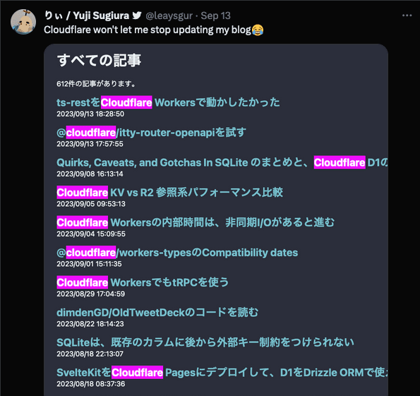

# Bindings from anywhere

2023/12/15 Cloudflare Workers Tech Talks #2

---

## About me 😉

---

### Yuji Sugiura

- 👨‍👩‍👧
- works at PixelGrid Inc.
- +side works


---

### りぃ / @leaysgur

- Twitter: [@leaysgur](https://twitter.com/leaysgur)
- GitHub: [leaysgur](https://github.com/leaysgur/)
- Blog: [Memory ice cubes](https://leaysgur.github.io/posts/)



---

## Today's theme...

---

## **Bindings** from anywhere 🧙

---

### Workers Bindings

> Bindings allow your Workers to interact with **resources on the Cloudflare Developer Platform**.
> https://developers.cloudflare.com/workers/configuration/bindings/

---

### For example...

- KV: Global, low-latency, key-value data storage
- R2: AWS S3 compat, 0 egress fee object storage
- D1: SQLite database running on the CDN edge
- Queues, Email, AI, Browser, etc...
  - 14? bindings are available for now

Variety and convenience! 🤩
You want to use it in different ways, don't you?

---

### Basic usage

```js
export default {
  // Through the `Env` parameter 👀
  async fetch(req, env, ctx) {
    const value = await env.MY_KV.get("hello");

    const stmt = env.MY_DB.prepare("INSERT INTO logs VALUES (?, ?)");
    const rows = await stmt.bind(value, 42).run();

    // ...
  },
};
```

☝️ Basically only accessible within the worker's handler.

---

### Other options(programmable)

- REST API
  - https://developers.cloudflare.com/api
- `wrangler xxx` CLI commands
  - https://developers.cloudflare.com/workers/wrangler/commands

Available bindings and features are very limited.

---

## DX and Challenges 💪

---

## 1️⃣ Building a simple web APIs

---

### Simple web APIs w/ bindings

- Like REST API
- No front-end assets(HTML, CSS, JS, etc...)

---

### Excellent ✨

- `wrangler dev` & `wrangler deploy`
  - Built-in TypeScript, `esbuild` support
  - Bindings are automatically setup
  - Chrome DevTools integration
- Fast deployment

---

## 2️⃣ Using Vite based front-end frameworks

---

### e.g. SvelteKit

- https://kit.svelte.dev
  - `@sveltejs/adapter-cloudflare`
- https://vitejs.dev
  - Core infrastructure for modern front-end frameworks™
  - Astro, Nuxt, SvelteKit, SolidStart, QwikCity, etc...
- Not just a SPA, using SSR altogether

---

### 💥 TypeError: Cannot read properties of undefined (reading 'env')

- `vite dev` is running on Node.js
- Bindings are not available at all... 😭
  - Cloudflare adapter do nothing on local development

---

### Workaround for local development

- Some frameworks have Vite plugin within its adapter
  - But [e](https://github.com/withastro/adapters/blob/main/packages/cloudflare/src/index.ts)-[a](https://github.com/solidjs/solid-start/blob/main/packages/start-cloudflare-pages/dev-server.js)-[c](https://github.com/cloudflare/next-on-pages/tree/main/internal-packages/next-dev)-[h](https://github.com/honojs/vite-plugins/blob/main/packages/dev-server/src/dev-server.ts) of them has its own, different implementation for the same goal... 🙃
- Mock runtime `env` by yourself
  - Intutive, but `miniflare` requires `await` to setup and `dispose()` to shutdown, `env.XXX` itself is a sync API though...
- Some frameworks may work with `wragnler pages dev && vite`?

---

### Thanks `miniflare`+`workerd` but,

- Currently a few of bindings are not supported
  - https://github.com/cloudflare/workers-sdk/issues/4360
- No idea to debug with remote data effectively
  - `wragnler pages dev && vite build --watch` takes tooooooooo much to reload

---

## 3️⃣ Scripts for daily operations

---

### Daily operations

- Like data aggregation for stats, user inquiry, etc...
- Upload and download assets for debugging
- Batch to update storaged data all at once
- etc...

---

### `wrangler xxx` is not enough 🤧

- Need to spawn and manage child processes
  - Although `zx` can make things a little easier
- I/O is not typed and need to be parsed
- Unfamiliar CLI arguments
  - `kv:bulk` only supports JSON format

---

## \*️⃣ And more

---

### How to...

- Set up local environment to develop with large amount of binary data in KV?
- Use D1 as source for Static Sites Generator?
- Test AI bindings before acutual deployment?
- Mix service bindings provided by other team?
  - https://github.com/cloudflare/workers-sdk/issues/1182

How can we make these DX better?

---

### Summary

- For different use cases, we need simple yet but flexible solution
- JavaScript API for Workers looks good
- It is nice to be run on especially Node.js and Bun
- `wrangler dev --remote` is the only way to access all bindings and features

Workers **Bindings** API running **from anywhere**...?

---

## cfw-bindings-wrangler-bridge 🌉

https://github.com/leaysgur/cfw-bindings-wrangler-bridge

---

### Bridge = Module + Worker

- Module
  - Workers Bindings API compatible
  - To be `import`ed into your application
  - Written as pure ESM, run on any environment
- Worker
  - Proxy worker to be invoked by the bridge module
  - Hosted by `wrangler dev` or `unstable_dev()` in advance

---

### 1. Worker usage

```sh
wrangler dev ./path/to/node_modules/cfw-bindings-wrangler-bridge/worker/index.js --remote
# Worker will be running on `http://127.0.0.1:8787` by default
```

or

```js
import { unstable_dev } from "wrangler";

const worker = await unstable_dev(
  "./path/to/node_modules/cfw-bindings-wrangler-bridge/worker/index.js",
  {
    local: false,
    config: "./path/to/your/wrangler.toml",
    experimental: { disableExperimentalWarning: true },
  },
);
// Worker will be running on `http://${worker.address}:${worker.port}`,
```

---

### 2. Module usage

```js
import { KVNamespace$ } from "cfw-bindings-wrangler-bridge";

const MY_KV = new KVNamespace$("MY_KV", {
  // or
  // bridgeWorkerOrigin: `http://${worker.address}:${worker.port}`,
});

await MY_KV.put("foo", "bar");
await MY_KV.get("foo"); // "bar"
```

That's all! 🎉

---

### How it works(simplified)

```js
// App
MY_KV.put("key", "value");
// ≒ Module
fetch(bridgeWorkerOrigin, {
  headers: { METHOD: "MY_KV.put" },
  body: stringify(["key", "value"]),
});

// ↓ HTTP Request ↑ Response

// Worker
const [NAME, METHOD] = req.headers.get("METHOD").split(".");
const res = await env[NAME][METHOD](...parse(req.body));
```

---

### Unique points

- Remote bindings access from local runtime
  - Includes AI bindings
- Remote and local bindings can be mixed
  - At any kinds
- Module is universal
  - Just a `fetch` client
  - May be portable to language other than JavaScript

---

### Demo

- https://github.com/leaysgur/sveltekit-d1-drizzle-template
- https://github.com/leaysgur/cfw-storage-bindings-studio

---

### Not perfect, but may be reasonable

- Supported bindings are limited
  - KV, R2, D1, Queue(Producer), Vectorize, Service
- Non-bindings are still missing
  - `req.cf`, `caches`, `ctx.waitUntil`

But if you want to use it for limited purposes, at least for me, it just works™ and very useful. 🤤

---

### Bright future?

- Although no roadmap has been published, it seems that team is WIP to support Vite
  - https://github.com/vitejs/vite/discussions/14288
  - But only for local
- Also created an issue about this, but...
  - https://github.com/cloudflare/workers-sdk/issues/3632
- Winter CG 👀
  - https://github.com/wintercg

---

## Thank you! 👋

