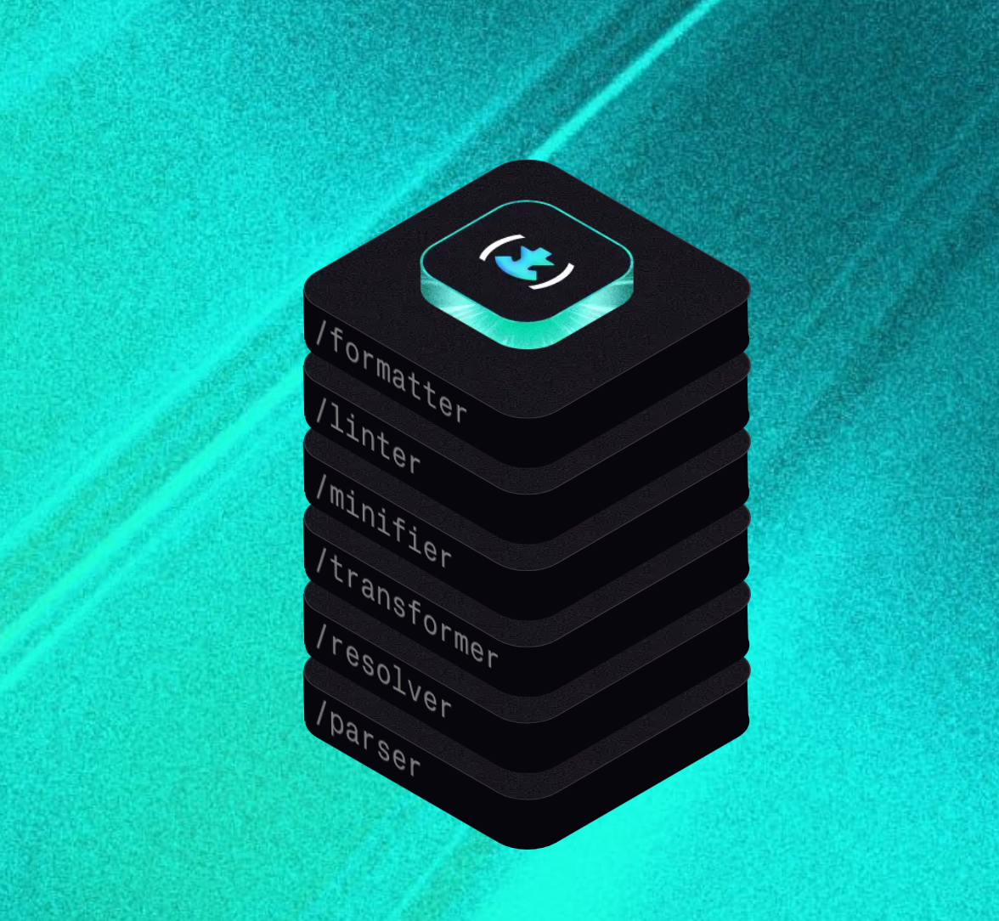
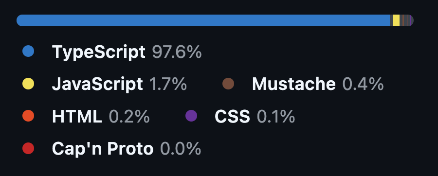

# Introduction to Oxfmt

2026/07/08 Cloudflare Workers Tech Talks in Kyoto #2

---

## About me 🍀

---

### Yuji Sugiura / りぃ

- 🧑‍🧑‍🧒‍🧒
- Cloudflare Inc. (2026/06~)
  - ex-VoidZero Inc.
- Oxc core team
- Follow me on:
  - Twitter: [@leaysgur](https://twitter.com/leaysgur)
  - GitHub: [leaysgur](https://github.com/leaysgur/)
  - Blog: [Memory ice cubes](https://leaysgur.github.io/posts/)


---

## Today's theme...

---

## Oxfmt ✨

---

### What is Oxfmt?

- `/oʊ-ɛks-fɔːr-mæt/`
- Code formatter
  - Like Prettier, dprint, Biome, etc...
- Based on Oxc ⚓️



---

### What is Oxc?

> A collection of **high-performance** JavaScript tools written in Rust 🦀

See https://oxc.rs/


---

### Wait, is this even about Cloudflare Workers?

- Nope...
  - Complaints go to yusukebe-senpai... 🙉
- Sit back and enjoy the break 🍵


---

### But there is a Cloudflare connection

> VoidZero, the company behind Vite, Vitest, Rolldown, Oxc, and Vite+, is joining Cloudflare.
> https://blog.cloudflare.com/voidzero-joins-cloudflare/

That said,

> Vite, Vitest, Rolldown, Oxc, and Vite+ will stay open source, vendor-agnostic, and community-driven. Nothing about that changes.

In short, it's just an OSS project!

---

### Who's using it?

- Cloudflare OSS, of course!
  - https://github.com/cloudflare/workers-sdk
  - https://github.com/cloudflare/agents
- Also spotted in some internal repos 🕵🏻‍♂️

---

### Ready for production?

- Status is beta
- But many adopters in the wild
  - https://github.com/vercel/turborepo
  - https://github.com/openclaw/openclaw
  - https://github.com/getsentry/sentry-javascript
  - etc...

---

## What makes it special?

---

### Fast alternative to Prettier

- Output aims to be Prettier compatible
  - For easy migration and adoption
  - Prettier has a long history
- But way better performance 🏎️

---

### How fast?

- https://github.com/cloudflare/workers-sdk
- Using `oxfmt@0.41`
- 4606 files to format
  - Typical TS monorepo, not so large



---

### `.oxfmtrc.jsonc`

```jsonc
{
  "printWidth": 80,
  "singleQuote": false,
  "semi": true,
  "useTabs": true,
  "trailingComma": "es5",
  "sortImports": {
    "groups": ["builtin", "external", "parent", "sibling", "index", "type"],
    "newlinesBetween": false
  },
  "sortTailwindcss": {},
  "sortPackageJson": {},
  "overrides": [
    {
      "files": ["packages/vite-plugin-cloudflare/README.md"],
      "options": {
        "useTabs": false,
        "trailingComma": "all"
      }
    },
    {
      "files": [".changeset/*.md"],
      "options": {
        "proseWrap": "never"
      }
    },
    {
      "files": ["packages/local-explorer-ui/**/*.{js,jsx,ts,tsx}"],
      "options": {
        "sortTailwindcss": {
          "stylesheet": "./packages/local-explorer-ui/src/styles/tailwind.css",
          "functions": ["cn"]
        }
      }
    }
  ],
  "ignorePatterns": [ /* OMITTED */ ]
}
```

---

### With `oxfmt@0.41.0`

```
$ hyperfine --runs 10 --prepare 'sleep 3' 'oxfmt'

Benchmark 1: oxfmt@0.41.0
  Time (mean ± σ):      1.310 s ±  0.033 s    [User: 7.530 s, System: 0.889 s]
  Range (min … max):    1.243 s …  1.358 s    10 runs
```

- **~1.3s** for the whole monorepo ⚡

---

### With `prettier@3.9.4` + 3 plugins

```
$ hyperfine --runs 10 --prepare 'sleep 3' 'prettier --write .'

Benchmark 1: prettier@3.9.4 + 3 plugins
  Time (mean ± σ):     20.747 s ±  0.457 s    [User: 31.847 s, System: 1.581 s]
  Range (min … max):   20.069 s … 21.415 s    10 runs
```

- **~20.7s** for the same monorepo 🐢
- Oxfmt is **~15x** faster

---

### `.prettierrc`

```jsonc
{
  "plugins": [
    "@ianvs/prettier-plugin-sort-imports",
    "prettier-plugin-packagejson",
    "prettier-plugin-tailwindcss"
  ],
  "printWidth": 80,
  "singleQuote": false,
  "semi": true,
  "useTabs": true,
  "trailingComma": "es5",
  "importOrder": ["<BUILTIN_MODULES>", "<THIRD_PARTY_MODULES>", "^\\.\\./", "^\\./", "<TYPES>"],
  "overrides": [ /* SAME AS BEFORE */ ]
}
```

- \+ `ignore.txt` for `ignorePatterns`, specified by `--ignore-path`

---

### With `oxfmt@0.57.0`

```
$ hyperfine --runs 20 --prepare 'sleep 3' 'oxfmt'

Benchmark 1: oxfmt@0.57.0 (latest)
  Time (mean ± σ):      1.057 s ±  0.025 s    [User: 5.992 s, System: 0.753 s]
  Range (min … max):    1.024 s …  1.118 s    20 runs
```

- Latest version is even faster: **~1.0s** 🚀
- Now **~20x** faster than Prettier

---

## Why so fast? 🤔

---

### CLI is fast

- CLI written in Rust 🦀
- Optimized for large repo
- Optimized with|without nested config

---

### Formatters are also fast

- Some formatters are re-implemented in Rust 🦀
  - Forked parser, then optimized, more coverages
- JS/TSX, JSON/JSONC/JSON5, CSS/SCSS/Less, GraphQL, TOML
  - More to come...! 💪
- Otherwise, fallback to Prettier(JS)

---

### Calling JS from Rust?

- NAPI-RS converts Rust code to N-API
  - https://napi.rs/
- Then Node.js calls it
  - JS callbacks can be passed too
    - e.g. Prettier, Tailwind class sorter
  - But slow, so we want to go all Rust 🏃🏻

---

### Why does speed matter anyway?

- Dev tools should be as fast as possible
- For both human and AI agent iterations
- Faster CI is also welcome
  - AI responses should be the only thing we wait for... 🫠

---

## (Honest) migration guide

---

### All Prettier supported languages are supported 👌

- JS/TS/TSX (incl. xxx-in-js)
- JSON/JSONC/JSON5
- CSS/SCSS/Less
- GraphQL
- YAML (+ TOML)
- Markdown/MDX
- HTML/Vue/Angular (+ Svelte*)
- Handlebars

---

### (Almost) All Prettier formatting options are supported 💅🏻

- https://prettier.io/docs/options
- Except for
  - `experimentalTernaries`
  - `experimentalOperatorPosition`

See https://oxc.rs/docs/guide/usage/formatter/config-file-reference.html

---

### Practical CLI features ⚙️

- Nested config support
  - = Directory scoped config
- JS/TS config file support
- Editor support
  - `--lsp`, `--stdin-filepath`
- `--migrate prettier`
- etc

See https://oxc.rs/docs/guide/usage/formatter/cli.html

---

### How about plugins?

- Prettier plugins are not supported 🙅🏻

---

### Instead, built-in plugins 💁🏻

- `sortImports`: [eslint-plugin-perfectionist/sort-imports](https://github.com/azat-io/eslint-plugin-perfectionist) inspired
- `sortPackageJson`: [prettier-plugin-packagejson](https://github.com/matzkoh/prettier-plugin-packagejson) inspired
- `sortTailwindcss`: [prettier-plugin-tailwindcss](https://github.com/tailwindlabs/prettier-plugin-tailwindcss) equivalent
- `jsdoc`: [prettier-plugin-jsdoc](https://github.com/homer0/prettier-plugin-jsdoc) equivalent
- `svelte`: [prettier-plugin-svelte](https://github.com/sveltejs/prettier-plugin-svelte) (requires `svelte/compiler`)

---

### 100% Prettier compatible?

- Strictly speaking, no
- We do aim for it, but not a perfect byte match
  - Prettier also has bugs and inconsistencies
  - Sometimes not following them is better
- Prettier shipped a new version last week
  - So, small gaps again..., now WIP while watching their direction
- Some CSS syntax is not covered yet
  - e.g. Non-spec syntax for postcss plugins

---

### So, should you migrate?

- Worth considering for most Prettier users 🙂
  - Unless you rely heavily on 3rd party plugins
  - Unless you need `experimentalXxx` options
- Even partial adoption improves speed
- Agent skill for migration is also available 🤖
  - https://www.skills.sh/oxc-project/oxc/migrate-oxfmt

---

## Bonus 📣

---

### Oxfmt Q3 Roadmap

- Working hard to Rust-ify all the languages
- We know you want more fine-grained options
  - But it will take a bit more time
  - (More options also mean config schema rework)

---

### We also have Oxlint

- Fast ESLint alternative
- With type-aware linting via `tsgolint`
- Custom plugins can be written in JS

See https://oxc.rs/docs/guide/usage/linter.html

---

### By the way, what is Vite+?

- All-in-one dev tool: Vite, Vitest, Oxlint, Oxfmt, and more
- Perfect companion for new projects!
  - Announced beta last week 🎉

See https://viteplus.dev/guide/

---

## Thank you! 👋
