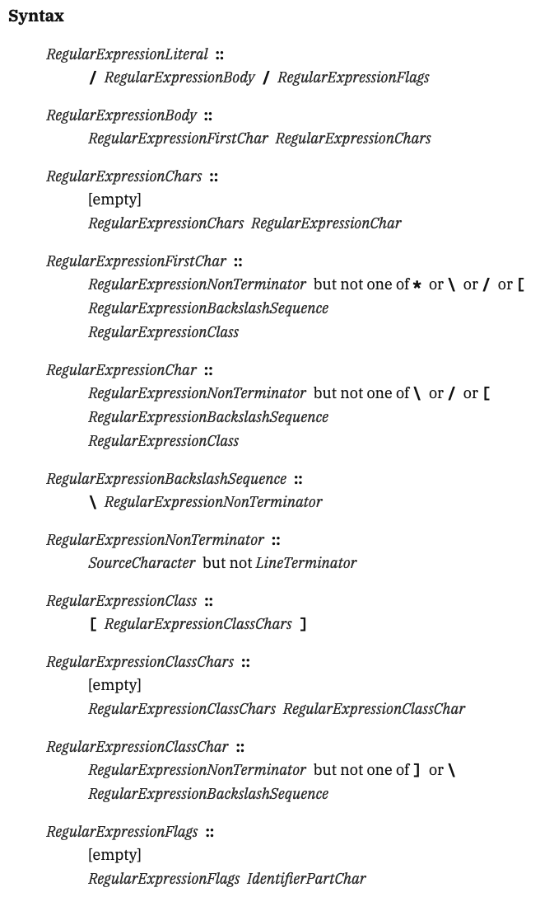
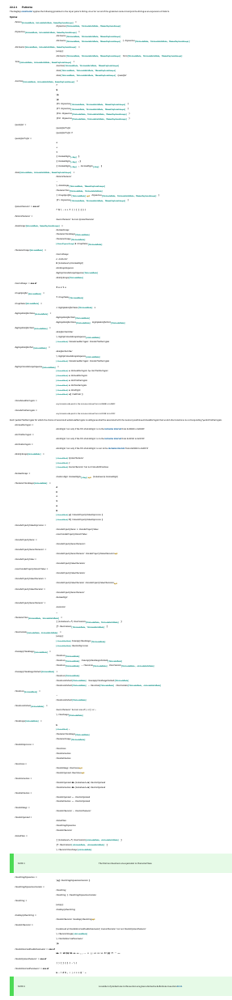

<style>
:root {
  /* # H1 */
  --h1-color: #e5e9f0;
  --heading-strong-color: #ebcb8b;
  /* Normal block */
  --bgColor-default: #3b4252;
  --fgColor-default: #eceff4;
  --fgColor-accent: #88c0d0;
  /* Code block */
  --borderColor-default: #5e81ac;
  --bgColor-muted: #2e3440;
  --fgColor-muted: var(--color, --fgColor-default);
}
</style>

# 30 Minutes to Understand All of **RegExp Syntax**

2024/11/23 JSConf JP 2024

---

## About me 👋

---

### Yuji Sugiura

- Frontend engineer
  - Works at PixelGrid Inc.
  - Self-employed
- OSS Contributor
  - ⚓️ https://oxc.rs
  - etc...


---

### @leaysgur

- X(Twitter): [@leaysgur](https://x.com/leaysgur)
- GitHub: [leaysgur](https://github.com/leaysgur/)
- Blog: [Memory ice cubes](https://leaysgur.github.io/posts/)


---

## Today's theme...

---

## `RegExp`


---

### What?

> Regular expressions are patterns used to match character combinations in strings.
> https://developer.mozilla.org/en-US/docs/Web/JavaScript/Guide/Regular_expressions

---

## Syntax


---

### syntax

> the rules that state how words and phrases must be used in a computer language
> https://www.oxfordlearnersdictionaries.com/definition/english/syntax?q=syntax

---

### `RegularExpressionLiteral` in JavaScript

```js
/** Main function! */
function main() {
  // ...

  const re = /     /v;
  //         ^^^^^^^^ HERE!

  // ...
}

// ...
```

How to parse it?

---

### `RegularExpressionLiteral` syntax

> https://tc39.es/ecma262/2024/#sec-literals-regular-expression-literals

(font-size: 18px 😀)



---

### Detail of `RegularExpressionBody`?

```js
const re = /     /v;
//          ^^^^^ HERE!!
```

Also defined?

---

### RegExp `Pattern` Syntax!

> https://tc39.es/ecma262/2024/#sec-patterns

(font-size: 2px 😇)



---

## ✋

- Q1. Has anyone here ever used regular expressions in JavaScript?
- Q2. && How many can say they fully understand the meaning of what they wrote?
- Q3. && Who knows all the available syntax for regular expressions?


---

### Someone says...

[](https://github.com/oxc-project/oxc/pull/3824#issuecomment-2228357476)

---

### Don’t worry!

You can learn it today! 👌

Once you understand the syntax, even the guides will be easier to follow.
When you look at it step by step, it’s actually not that difficult.

---

### `oxc_regular_expression`

ECMAScript 2024+ `RegExp` parser written in Rust for OXC project.

> https://github.com/oxc-project/oxc/tree/main/crates/oxc_regular_expression

I'm an author! 😎

---

## 🍀 Lesson 1 / Pattern and flags

---

### RegExp = Pattern + Flags

```js
// Literal
let re = /pattern/flags;
// Constructor
let re = new RegExp("pattern", "flags");
```

---

### Pattern syntax

TODO: Check it later!

---

### Flags syntax

```js
let re = /pattern/dgimsvy;
```

- Specify in lowercase
- Order does not matter
- https://developer.mozilla.org/en-US/docs/Web/JavaScript/Reference/Errors/Bad_regexp_flag
  - Any character not in the list will cause an error
  - Even characters in the list will cause an error if duplicated
  - The `u` and `v` flags are mutually exclusive

---

### Flags in ES2024

1. in`d`ices: `hasIndices`
2. `g`lobal: `global`
3. `i`nsensitive: `ignoreCase`
4. `m`ultiline: `multiline`
5. `s`ingle line: `dotAll`
6. `u`nicode: `unicode`
7. `v`nicode: `unicodeSets` added in ES2024 🆕
8. styick`y`: `sticky`

---

### Unicode mode flags affect the syntax

- `u`: Enable unicode-aware mode
  - a.k.a. UnicodeMode
- `v`: Enable unicode-aware mode & upgrade 💪
  - a.k.a. UnicodeSetsMode

Always use `v` flag!
The syntax has become more sophisticated, and ambiguous expressions can no longer be used.


---

### FYI: `v` flag

Works as the same as `pattern` attribute in HTML.

```html
<label for="pin">PIN: (4 digits)</label>
<input id="pin" name="pin" type="password" pattern="\d{4}" required />
```

> https://developer.mozilla.org/en-US/docs/Web/HTML/Attributes/pattern

---

<!-- _backgroundColor: #eceff4 -->
<!-- _color: #4c566a -->

## ☕️ Break 1 / Literal or constructor

---

<!-- _backgroundColor: #eceff4 -->
<!-- _color: #4c566a -->

### Literal syntax

```js
// const re0 = //;
const re1 = /abc/;
const re2 = /Hello, "JSConf (\d+)"!/u;
const re3 = /こんにちは/v;
```

- Enclose with `/` and `/`, followed immediately by the flags
- It cannot be empty 
  - It would become a line comment!
- The first character cannot be `*`
  - It would become a block comment!

Invalid syntax will result in a `SyntaxError` and cannot be executed!


---

<!-- _backgroundColor: #eceff4 -->
<!-- _color: #4c566a -->

### `RegExp` Constructor

```js
const re0 = new RegExp(); // = /(?:)/
const re1 = new RegExp("abc");
const re2 = new RegExp('Hello, "JSConf (\\d+)"!', "u");
let こんにちは = `\u3053\u3093\u306b\u3061\u306f`;
const re3 = new RegExp(こんにちは, "v");
```

- Pass either a string literal or a template literal
  - Arguments can be empty, in which case a placeholder will be used
- Since it's a string literal:
  - Special characters must be escaped using `\`
  - Escape sequences can also be used, but... 😵‍💫

Can be dynamic, but invalid syntax are only detected at runtime.
Prefer literals if possible!


---

## 🔠 Lesson 2 / `Pattern` syntax

---

### Hard part of `RegExp` pattern syntax?

- There are so many rules... it's hard to know what to write
- It's unclear where escaping is necessary?
- There are multiple ways to write the same thing, which can be confusing
- etc..

Alright, let’s learn the syntax!


---

### Friendly Reminder? 🤤


---

### You don't need them all!

The spec is a product of historical layers, and some of them are:

- Too verbose
  - A nature of the spec to avoid ambiguity
- Rarely or never used syntax
- Obsoleted by new flags

Prefer the `v` flag to use the latest syntax!

---

### Role of characters in `RegExp` pattern

You can think of them by its role.

- 1: Match single character unit
- 2: Match set of character units
- 3: Help matching
- 4: Memoize and reuse

---

## Lesson 2 / Indexes

- 👉🏻 1: Match single character unit
- 2: Match set of character units
- 3: Help matching
- 4: Memoize and reuse

---

### 1a: Literal character

Simple matching for exact `PatternCharacter`.

```js
let re = /ecma262/v;
let re = /Hello! 😄/v;
```

You should not use `RegExp` in this case, though.

FYI: `String.prototype` `.includes()`, `.startsWith()`, and `.endsWith()`

> https://developer.mozilla.org/en-US/docs/Web/JavaScript/Reference/Global_Objects/String#instance_methods

---

### 1a: Literal character

Need `\` escape for `SyntaxCharacter`(one of `^$\.*+?()[]{}|`) and `/` in literal usage.

```js
// ./routes/concerts/$city.tsx
let re = /\.\/routes\/concerts\.\$city\.tsx/v;
//        ^ ^       ^         ^ ^     ^
let re = new RegExp("\\./routes/concerts\\.\\$city\\.tsx", "v");
//                   ^^                 ^^ ^^     ^^
```

⚠️ Literal `\` itself requires escape `\` in string literal.

FYI: Stage 3 proposal-regex-escaping

> https://github.com/tc39/proposal-regex-escaping

---

### 1b: Character escape

Special characters start with `\` escape.

e.g. `ControlEscape`: `\t`, `\n`, etc...

```js
let re = /\f\n\r\t\v/v;

let re = /---\n\ttitle\n---/v;
re.test(`---
	title
---`); // true
```

Technically, escaped syntax characters are also this kind as `IdentityEscape`.

---

### 1b: Character escape

Full list:

```js
[
  /\t/v, // Control escape
  /\$/v, // Identity escape

  /\cA/v, // Control character
  /\0/v, // NUL character
  /\x1A/v, // Unicode code point by 2 digits HEX
  /\u0007/v, // Unicode code point by 4 digits HEX
  /\uD83D\uDE03/v, // Surrogate pair for 😃
  /\u{1F600}/v, // Unicode code point by 1-6 digits HEX
];
```

For those who want to interact with binary strings...?

---

## Lesson 2 / Indexes

- ✅ 1: Match single character unit
- 👉🏻 2: Match set of character units
- 3: Help matching
- 4: Memoize and reuse

---

### 2a: Wildcard

Dot(`.`) is wildcard match, expect line terminators.

```js
let re = /Hello. world./v;

re.test("Hello, world!"); // true
re.test("Hello! world."); // true
re.test("Hello~ worlds"); // true
re.test(`
Hello, world
`); // false
```

You should use `\.` to match literal `.`.

---

### 2a: Wildcard

With `s`(`dotAll`) flag, `.` can match line terminators!

```js
let re = /Hello. world./vs;

re.test(`
Hello, world
`); // true
```

---

### 2b: Character class escape

Preset that matches set of characters.

```js
[
  /\d/v, // Matches numbers between 0-9
  /\s/v, // Matches whitespaces or line terminators
  /\w/v, // Matches ASCII letters A-Z, a-z, numbers 0-9, or _
];
```

`\D`, `\S` and `\W` match any character that is NOT matched by the lowercase form.

With `i` flag, `\w` also supports Unicode Default Case Conversion.

```js
// ſ (U+017F LATIN SMALL LETTER LONG S) => s (U+0073 LATIN SMALL LETTER S)
/\w/i.test("ſ"); // false
/\w/vi.test("ſ"); // true
```

> https://unicode.org/Public/UCD/latest/ucd/CaseFolding.txt

---

<!-- _backgroundColor: #eceff4 -->
<!-- _color: #4c566a -->

## 🍵 Break 2 / UTF-16, Unicode, and grapheme clusters

---

<!-- _backgroundColor: #eceff4 -->
<!-- _color: #4c566a -->

### UTF-16

In JavaScript, strings are sequence of UTF-16 code units.

```js
// For us
let str = "hey!";

// For JS
[104, 101, 121, 33];

str.length; // 4
str.split("").length; // 4
```

UTF-16 = 16 bits / code unit.

Only 65,536 kinds of characters can be used...? 🙄

---

<!-- _backgroundColor: #eceff4 -->
<!-- _color: #4c566a -->

### Surrogate pair

In UTF-16, some characters are represented as surrogate pair.

```js
// For us
let str = "🤗";

// For JS
[55358, 56599];

str.length; // 2
str.split("").length; // 2

// [35, (55358, 56697), 35] UTF-16 code unit surrogate pair
/#.#/.test("#🥹#"); // false
```

2(High surrogate + Low surrogate) units as 1 character.

---

<!-- _backgroundColor: #eceff4 -->
<!-- _color: #4c566a -->

### Unicode aware mode

`u` or `v` flag to the rescue!

```js
// [35, 129401, 35] Unicode code point!
/#.#/v.test("#🥹#"); // true
```

Unicode 16.0.0 contains 154,998 characters!

---

<!-- _backgroundColor: #eceff4 -->
<!-- _color: #4c566a -->

### Grapheme clusters

`String.prototype[Symbol.iterator]()` can split strings by Unicode code points.

```js
/#.#/v.test("#🥹#"); // true
[..."🥹"]; // ["🥹"]
```

But some emojis are joined form of Unicode, grapheme clusters are not kept.

```js
/#.#/v.test("#🇯🇵#"); // false
[..."🇯🇵"]; // ["🇯", "🇵"]

[..."👈🏻"]; // ["👈", "🏻" ]
[..."🧑‍🧑‍🧒‍🧒"]; // ["🧑", "‍<ZWJ>", "🧑", "‍<ZWJ>", "🧒", "‍<ZWJ>", "🧒"]
[..."🧑🏻‍❤️‍💋‍🧑🏼"]; // ["🧑", "🏻", "‍", "❤", "️", "‍", "💋", "‍", "🧑", "🏼"]
```

You may need implementation like `Intl.Segmenter`.

---

### 2c: Unicode character class escape

`\p{`name`=`value`}`, `\p{`name_or_value`}` perform matches based on unicode properties.

`\P{`...`}` matches any character that is NOT matched by the lowercase form.

```js
// May be better `\w` alternative for non-latin users
let re = /\p{General_Category=Letter}/v; // or `\p{Letter}` or `\p{L}`
// No worries about i18n
let re = /\p{Currency_Symbol}\d/v; // Matches "$1", "€2", "¥3", etc...
// Script based match
let re = /\p{sc=Hiragana}/v;
```

Check properties and characters relationship before use.

> https://tc39.es/ecma262/2024/multipage/text-processing.html#table-nonbinary-unicode-properties

---

### 2c: Unicode character class escape

Binary Unicode properties of strings can match joined form of emojis!

```js
/#\p{RGI_Emoji}#/v.test("#🇯🇵#"); // true
// More specific
/#\p{RGI_Emoji_Flag_Sequence}#/v.test("#🇯🇵#"); // true
```

Matched unit may contain strings, not only a single unicode character.

> https://tc39.es/ecma262/2024/multipage/text-processing.html#table-binary-unicode-properties-of-strings

---

### 2d: Character class

`CharacterClass` matches any unit in `[`...`]`, or not in `[^`...`]`.

```js
let re = /\.[jt]s/v;

re.test(".js"); // true
re.test(".ts"); // true
re.test(".vs"); // false
```

Listed characters are specified as `ClassUnion`.

`[jt]` means `j` OR `t`, `[jjjtttjtjtjtjt]` is also valid and the same. 😅

FYI: `\d` and `[0123456789]` is the same!

---

### 2d: Character class

Dash(`-`) is a special and used to specify range, inclusive.

```js
let re = /ES202[012345]/v;
// is equivalent to
let re = /ES202[0-5]/v; // Matches ES2020, ES2021, ..., ES2025
```

Range should be ordered by unicode point ASC.

`[a-a]` is also valid and equivalent to `[a]`, literal `a`.

FYI: `\d` and `[0-9]` is the same!

---

### 2d: Character class

With `v` flag, `ClassSetExression` can also specify `ClassIntersection` and `ClassSubtraction`.

```js
// Hiragana OR katakana
let re = /[\p{Script=Hiragana}\p{Script=Katakana}]/v;

// Greek && letter
let re = /[\p{Script_Extensions=Greek}&&\p{Letter}]/v;
// 650 number characters -- 10 ASCII number characters
let re = /[\p{Decimal_Number}--[0-9]]/v;
```

Can not mix operations on the same nest level.

---

### 2d: Character class

With `v` flag, substrings `\q{`...`}` can be used.

```js
// Line terminators + CRLF!
let re = /[\r\n\u2028\u2029\q{\r\n}]/v;

// Chance to run JSConf XX
let re =
  /[\p{RGI_Emoji_Flag_Sequence}--\q{🇨🇱|🇮🇳|🇲🇽|🇺🇸|🇭🇺|🇺🇸|🇰🇷|🇯🇵|🇩🇪|🇦🇺|🇦🇷|🇧🇷|🇨🇴|🇸🇬|🇮🇸|🇺🇾|🇧🇪|🇨🇳}]/v;
```

`|` works as OR inside of `\q{`...`}`.

---

### 2e: Quantifier

Repeat the previous unit N~M times.

```js
let re = /jsx?/v; // Matches "js" or "jsx"
let re = /\p{Script=Hiragana}+/v; // Hiragana only, at least 1

let re = /\d\d\d/v;
// equivalent to
let re = /\d{3}/v;
```

Greedy by default. Add post-`?` to make it non-greedy.

```js
// Greedy
"INPUT: <p><em>lorem</em> <i>ipsum</i></p>".replaceAll(/<.+>/vg, ""); // "INPUT: "
//       ^^^^^^^^^^^^^^^^^^^^^^^^^^^^^^^^

// Non-greedy
"INPUT: <p><em>lorem</em> <i>ipsum</i></p>".replaceAll(/<.+?>/vg, ""); // "INPUT: lorem ipsum"
//       ^  ^^       ^^^   ^       ^^  ^^
```

---

### 2e: Quantifier

Variation of quantifiers.

|           |  Min  |   Max    |
| :-------: | :---: | :------: |
|     ?     |   0   |    1     |
|    \*     |   0   | Infinity |
|     +     |   1   | Infinity |
|  {count}  | count |  count   |
|  {min,}   |  min  | Infinity |
| {min,max} |  min  |   max    |

---

## Lesson 2 / Indexes

- ✅ 1: Match single character unit
- ✅ 2: Match set of character units
- 👉🏻 3: Help matching
- 4: Memoize and reuse

---

### 3a: Disjunction

Use `|` to create `Alternative` matching branch.

```js
let re = /jsx|tsx|vue|svelte/v;

// Can be empty but useless
let re = /||||/v;
```

In `CharacterClass`, `|` is just literal `|` and need `\` escape.

```js
// SyntaxError
// let re = /[j|t]s/v;
let re = /[j\|t]s/v;
```

---

### 3b: Non-capturing group

Create subpattern with `(?:`...`)`.

```js
// Matches ".jsx", "vue" or "svelte"
let re = /\.jsx|vue|svelte/v;

// Matches ".jsx", ".vue" or ".svelte"
let re = /\.(?:jsx|vue|svelte)/v;
```

---

### 3c: Input boundary assertion

`Assertion` for input boundary. `^` for start, `$` for end.

```js
// HTTP(S) scheme?
let re = /^https?:\/\//

// Trailing slash?
let re = /.+\/$/v;
```

`\A` and `\z` do not exist in JavaScript `RegExp`. Use `m` flag to enable `multiline` mode.

`/^$^$^$^$^$^$^/` is also valid syntax. 😅

---

### 3d: Word boundary assertion

`Assertion` for word boundary. `\b` or `\B` to negate.

```js
let re = /\bhello\b/v;

re.test("hello!"); // true
re.test("Say hello to you"); // true
re.test("hellooooooo"); // false
```

Simply, it checks next to `\w` match or NOT.
May not useful for non-latin users.

---

### 3e: Lookaround assertion

`Assertion` by lookaround.

- Lookahead: `(?=`...`)`, negative `(?!`...`)`
- Lookbehind: `(?<=`...`)`, negative `(?<!`...`)`

```js
// Matches "550" in "550円"
let re = /^\d+(?=円)$/v;
// Matches "9" in "$9"
let re = /^(?<=\$)\d+$/v;

// Simple check for valid name as Identifier in JS?
let re =
  /^(?!(?:break|case|...)$)[$_\p{ID_Start}][$\u200c\u200d\p{ID_Continue}]*$/v;
```

---

## Lesson 2 / Indexes

- ✅ 1: Match single character unit
- ✅ 2: Match set of character units
- ✅ 3: Help matching
- 👉🏻 4: Memoize and reuse

---

### 4a: Capturing group

Simply wrap with `(`...`)` create capturing group.

```js
let match = /(js|ts)x/v.exec("tsx");
if (match) {
  match[1]; // "ts"
}
```

Use non-capturing group `(?:`...`)` for perf.

---

### 4a: Capturing group

You can add unique `?<`name`>`, `GroupSpecifier` to refer it later.

```js
let match = /(?<lang>js|ts)x/v.exec("jsx");
if (match) {
  match.groups.lang; // "js"
  match[1]; // "js"
}

let match = /(js|ts)x/v.exec("tsx");
if (match) {
  match.groups; // undefined
  match[1]; // "ts"
}
```

Name is optional, but recommend to add for clarity.

---

### 4b: Backreference

Refer capturing groups.

- By index: `\1`, `\2`, etc...
- By name: `\k<`name`>`

```js
// Extract `title` attribute value 
// e.g. `title="HERE"`, `title='"HERE"'`, `title="HERE'WE'GO!"`, etc...
let re = /title=(?<quote>["'])(?<contents>.*?)\k<quote>/v;
```

It will be error if group name does not exists.

```js
// SyntaxError
let re = /\k<noop>/v;

// This is valid
let re = /\k<later>..(?<later>...)/v;
```

---

### Lesson 2 / Indexes

- ✅ 1: Match single character unit
  - a: Literal character / b: Character escape
- ✅ 2: Match set of character units
  - a: Wildcard / b: Character class escape / c: Unicode character class escape
  - d: Character class / e: Quantifier
- ✅ 3: Help matching
  - a: Disjunction / b: Non-capturing group
  - c: Input boundary assertion / d: Word boundary assertion / e: Lookaround assertion
- ✅ 4: Memoize and reuse
  - a: Capturing group / b: Backreference

---

<!-- _backgroundColor: #eceff4 -->
<!-- _color: #4c566a -->

## 🫖 Break 3 / Static Semantics: Early Errors

---

<!-- _backgroundColor: #eceff4 -->
<!-- _color: #4c566a -->

### SS: Early Errors

If syntactically correct but semantically incorrect, throw `SyntaxError`.

> https://tc39.es/ecma262/2024/multipage/text-processing.html#sec-patterns-static-semantics-early-errors

---

<!-- _backgroundColor: #eceff4 -->
<!-- _color: #4c566a -->

### SS: Early Errors

- If the number of capturing group open parens `(` > 2^32
- If `Quantifier` `a{N,M}` digits are NOT N <= M
- If `CharacterClass` range of character value `[N-M]` are NOT N <= M
- If `\k<name>` refered but `(?<name>)` not captured
- If unknown property name or value are used in Unicode character class escape
- If `[^`...`]` contain units that match strings(= `MayContainStrings`)
  - `MayContainStrings`: `\p{RGI_EMOJI}`, `[\q{abc}]`, etc...
- etc...

> https://github.com/search?q=repo%3Aoxc-project%2Foxc+%22%5BSS%3AEE%5D%22+path%3A%2F%5Ecrates%5C%2Foxc_regular_expression%5C%2Fsrc%5C%2Fparser%5C%2Fpattern_parser%5C%2F%2F&type=code

---

## 📜 Lesson 3 / Summary

---

### Syntax overview

Let's walk through the "simplified" spec!

Thank you `v` flag. 😉


---

### 1/7

```
Pattern ::
  Disjunction

Disjunction ::
  Alternative
  Alternative | Disjunction

Alternative ::
  [empty]
  Alternative Term
```

(FYI: This format is called "Extended Backus-Naur Form".)

---

### 2/7

```
Term ::
  Assertion
  Atom
  Atom Quantifier

Assertion ::
  ^
  $
  \b
  \B
  (?= Disjunction )
  (?! Disjunction )
  (?<= Disjunction )
  (?<! Disjunction )

Quantifier ::
  QuantifierPrefix
  QuantifierPrefix ?

QuantifierPrefix ::
  *
  +
  ?
  { DecimalDigits }
  { DecimalDigits , }
  { DecimalDigits , DecimalDigits }
```

---

### 3/7

```
Atom ::
  PatternCharacter
  .
  \ AtomEscape
  CharacterClass
  ( GroupSpecifier[opt] Disjunction )
  (?: Disjunction )

PatternCharacter ::
  SourceCharacter but not SyntaxCharacter

SyntaxCharacter :: one of
  ^ $ \ . * + ? ( ) [ ] { } |

GroupSpecifier ::
  ? GroupName
```

---

### 4/7

```
AtomEscape ::
  DecimalEscape
  CharacterClassEscape
  CharacterEscape
  k GroupName

DecimalEscape ::
  NonZeroDigit DecimalDigits[opt] [lookahead ∉ DecimalDigit]

CharacterClassEscape ::
  d
  D
  s
  S
  w
  W
  p{ UnicodePropertyValueExpression }
  P{ UnicodePropertyValueExpression }

UnicodePropertyValueExpression ::
  UnicodePropertyName = UnicodePropertyValue
  LoneUnicodePropertyNameOrValue
```

---

### 5/7

```
CharacterEscape ::
  ControlEscape
  c AsciiLetter
  0 [lookahead ∉ DecimalDigit]
  HexEscapeSequence
  RegExpUnicodeEscapeSequence
  IdentityEscape

ControlEscape :: one of
  f n r t v

RegExpUnicodeEscapeSequence ::
  u HexLeadSurrogate \u HexTrailSurrogate
  u HexLeadSurrogate
  u HexTrailSurrogate
  u HexNonSurrogate
  u{ CodePoint }

IdentityEscape ::
  SyntaxCharacter
  /

GroupName ::
  < RegExpIdentifierName >
```

---

### 6/7

```
CharacterClass ::
  [ [lookahead ≠ ^] ClassContents ]
  [^ ClassContents ]

ClassContents ::
  [empty]
  ClassSetExpression

ClassSetExpression ::
  ClassUnion
  ClassIntersection
  ClassSubtraction

ClassUnion ::
  ClassSetRange ClassUnion[opt]
  ClassSetOperand ClassUnion[opt]

ClassIntersection ::
  ClassSetOperand && [lookahead ≠ &] ClassSetOperand
  ClassIntersection && [lookahead ≠ &] ClassSetOperand

ClassSubtraction ::
  ClassSetOperand -- ClassSetOperand
  ClassSubtraction -- ClassSetOperand
```

---

### 7/7

```
ClassSetRange ::
  ClassSetCharacter - ClassSetCharacter

ClassSetOperand ::
  NestedClass
  ClassStringDisjunction
  ClassSetCharacter

NestedClass ::
  [ [lookahead ≠ ^] ClassContents ]
  [^ ClassContents ]
  \ CharacterClassEscape

ClassStringDisjunction ::
  \q{ ClassStringDisjunctionContents }

ClassStringDisjunctionContents ::
  ClassString
  ClassString | ClassStringDisjunctionContents

ClassString ::
  [empty]
  NonEmptyClassString

NonEmptyClassString ::
  ClassSetCharacter NonEmptyClassString[opt]

ClassSetCharacter ::
  [lookahead ∉ ClassSetReservedDoublePunctuator] SourceCharacter but not ClassSetSyntaxCharacter
  \ CharacterEscape[+UnicodeMode]
  \ ClassSetReservedPunctuator
  \b

ClassSetReservedDoublePunctuator :: one of
  && !! ## $$ %% ** ++ ,, .. :: ;; << == >> ?? @@ ^^ `` ~~

ClassSetSyntaxCharacter :: one of
  ( ) [ ] { } / - \ |

ClassSetReservedPunctuator :: one of
  & - ! # % , : ; < = > @ ` ~
```

---

### Finish!

Now you understand all of **RegExp Syntax**! 👏

Easier than you expected?

---

<!-- _backgroundColor: #eceff4 -->
<!-- _color: #4c566a -->

## 🍹 Break 4 / Annex B

---

<!-- _backgroundColor: #eceff4 -->
<!-- _color: #4c566a -->

### Additional syntax

> This annex describes various legacy features and other characteristics of web browser ECMAScript hosts. 
> These features are not considered part of the core ECMAScript language.

> Programmers should not use or assume the existence of these features and behaviours when writing new ECMAScript code.

🙄

> https://tc39.es/ecma262/2024/multipage/additional-ecmascript-features-for-web-browsers.html#sec-regular-expressions-patterns

Some syntax are ammended...

---

<!-- _backgroundColor: #eceff4 -->
<!-- _color: #4c566a -->

### 

> ECMAScript implementations are discouraged from implementing these features unless the implementation is part of a web browser or is required to run the same legacy ECMAScript code that web browsers encounter.

😲

> However, the usage of these features by large numbers of existing web pages means that web browsers must continue to support them. 

🥲

---

## 🔮 Lesson 4 / ES2025+

---

### [Finished] Duplicated named capture groups

```js
// ES2024: Can not be duplicated!
let re = /(?<year>[0-9]{4})-[0-9]{2}|[0-9]{2}-(?<year>[0-9]{4})/v;
//           ^^^^                                ^^^^

// ES2025: Can be duplicated in the same `Disjunction`'s `Alternative`
let re = /(?<year>[0-9]{4})-[0-9]{2}|[0-9]{2}-(?<year>[0-9]{4})/v;
//       |   ^^^^                   |            ^^^^          |
//       |     Alternative #1-1     |    Alternative #1-2      |
//       |                   Disjunction #1                    |
```

> https://github.com/tc39/proposal-duplicate-named-capturing-groups

---

### [Stage 4] Modifier

Extensiton for non-capturing group.

```js
let re = /^[a-z](?-i:[a-z])$/i;
//                ^^ OFF
let re = /^(?i:[a-z])[a-z]$/;
//           ^ ON
```

Locally modifies global flags `i`, `m` and `s`.

> https://github.com/tc39/proposal-regexp-modifiers

---

### Upcoming...

- [Stage 2] Buffer boundaries
  - https://github.com/tc39/proposal-regexp-buffer-boundaries
- [Stage 1] Extended Mode and Comments
  - https://github.com/tc39/proposal-regexp-x-mode
- [Stage 1] `\R` escape
  - https://github.com/tc39/proposal-regexp-r-escape
- [Stage 1] Atomic operators
  - https://github.com/tc39/proposal-regexp-atomic-operators

All of proposals are maintained by [@rbuckton](https://github.com/rbuckton). 😲

---

# Thank you!
