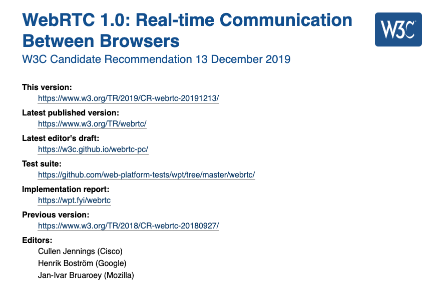
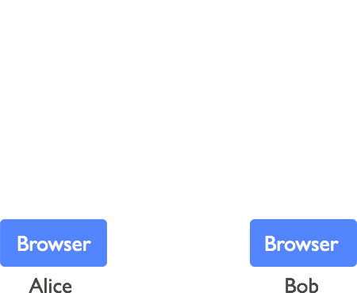
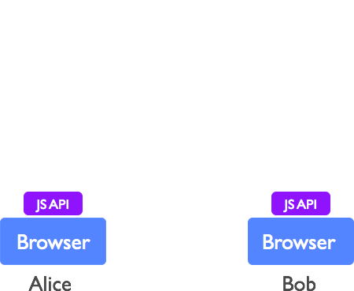
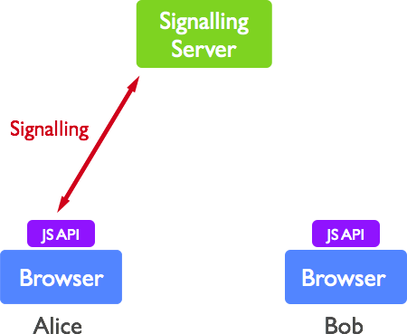
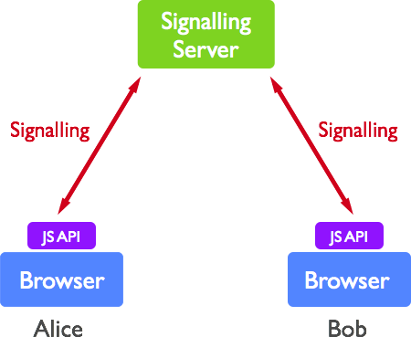
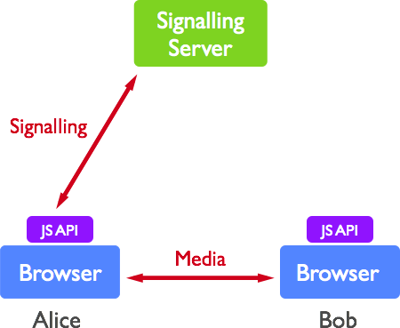

# APIs around the `WebRTC`
2020/04/15 PWA Night vol.15

---

# About me

---

## About me 1/2

- Yuji Sugiura
- NTT Communications
  - Web Engineer


---

## About me 2/2

- Twitter: [@leader22](https://twitter.com/leader22)
- GitHub: [leader22](https://github.com/leader22/)
- Blog: [console.lealog();](https://lealog.hateblo.jp/)


---

# Today's theme

---


---

# What is `WebRTC`?

---

## is WebRTC...?
### 🙆🏻‍♂️  🙅🏻‍♀️


---

## WebRTC: as protocol suite

- https://tools.ietf.org/html/draft-ietf-rtcweb-overview-19
- and many many, ... many other RFCs and drafts 🤯


---

## WebRTC: as W3C API

- https://tools.ietf.org/html/draft-ietf-rtcweb-jsep-26
- https://w3c.github.io/webrtc-pc/
- `RTCPeerConnection`
  - `RTCRtpXxx`



---

## WebRTC: as APIs around(includes) the `WebRTC` API

- `RTCPeerConnection`
- `navigator.mediaDevices`
- `MediaStream`, `MediaStreamTrack`
- `MediaRecorder`
- `WebAudio`
- `HTMLMediaElement`
- etc...

☝🏻 Today's main theme

---

# Table of Contents

1. About W3C `WebRTC` API
2. APIs around the `WebRTC`
3. RTC APIs in the future

---

# About W3C `WebRTC` API

---

## What can WebRTC do?

> There are many different use-cases for WebRTC, from basic web apps that **uses the camera or microphone**, to more advanced **video-calling applications and screen sharing**.

from https://webrtc.org/

---

## ⚠️ Simplified explanation

- `WebRTC` protocols are huge and complicated
- And W3C `WebRTC` also has a lot of APIs 😇

So today, I'll introduce the concepts only 🎯

---

## Example scenario

- P2P video-calling application
- Bidirectional communication between Alice 👩 and Bob 👨



---

## Procedure 1/4

- Alice & Bob: Set up
  - Get user media device and permission to send
  - Create `RTCPeerConnection` instance



---

## Procedure 2/4

- Alice: Create and send OFFER via Signaling server
  - I want to send & receive video+audio w/ codec A, params B
  - My global IP address and port is `x.x.x.x:yyyyy`
  - etc...



---


## Procedure 3/4

- Bob: Receive OFFER via Signaling server
- Bob: Apply OFFER to own `RTCPeerConnection` instance
- Bob: Create and send back ANSWER via Signaling server
  - I also want to send & receive video+audio w/ codec A, params B
  - My global IP address and port is `x.x.x.x:yyyyy`
  - etc...



---

## Procedure 4/4

- Alice: Receive ANSWER via Signaling server
- Alice: Apply ANSWER to own `RTCPeerConnection` instance
- Alice & Bob: Media flows 👏



---

## Summary

- Exchange OFFER and ANSWER to establish P2P connection
  - OFFER may be accepted or declined = negotiation
- The 3rd person something like Signaling server is needed
  - WebSocket, REST, etc...
  - No required format
- You may need SDK for client
  - Instead of handling raw `RTCPeerConnection`


---

## How to try `WebRTC`?

- Find demo sites through the Internet
  - "webrtc demo" 🔍
- Create your own demo in 1 page(tab)
  - Do not need signaling server
  - "webrtc handson" 🔍
- Deploy your own demo
  - Signaling server is needed

---

# APIs around the `WebRTC`

---

## `WebRTC` 🤝 `PWA` ?

- `RTCPeerConnection` requires network connection 📶
  - Not suitable for offline app
- But other APIs are available 😉

---

## Establish P2P connection

```js
// sender side
const pc1 = new RTCPeerConnection();
// RTCRtpSender
const sender = pc1.addTrack(track, stream);

/* ... negotiation flows are omitted ... */

// receiver side
pc2.addEventListener("track", ev => {
  // RTCRtpReceiver
  const { receiver } = ev;
  $video.srcObject = new MediaStream([receiver.track]);
});
```

- It just works™️
  - For most common cases, but in detail...🙈

> https://dontcallmedom.github.io/webrtc-impl-tracker/?webrtc

---

## Get `MediaStream` from user media devices

```js
// for camera, microphone
await navigator.mediaDevices.getUserMedia({ video: true, audio: true });

// for screen sharing
await navigator.mediaDevices.getDisplayMedia({ video: true });
```

- Safari 13.1 now supports `getDisplayMedia()` ✌️
- Mobile browsers does not support `getDisplayMedia()`

---

## Render `MediaStream`

```js
// from MediaStream
videoElement.srcObject = stream;

// from MediaStreamTrack
audioElement.srcObject = new MediaStream([audioTrack]);
```

- Be careful for `autoplay` restriction 📱
- And be sure to add `playsinline` for mobile browsers
- Never forget to `play()` it

---

## Process `MediaStream` from other sources

```js
// from canvas or other HTMLMediaElement
canvasElement.captureStream(fps);

// from WebAudio
audioContext.createMediaStreamDestination();
```

- `captureStream()` is still experimental 🧪

---

## Tips using `MediaStream`

- Virtual background
  - https://github.com/leader22/chromakey
    - demo1: https://leader22.github.io/chromakey/
    - demo2: https://leader22.github.io/chromakey/tfjs-body-pix/index.html
- Voice activity detection
  - https://github.com/otalk/hark
  - https://github.com/Jam3/voice-activity-detection
  - https://github.com/kdavis-mozilla/vad.js
  - etc...

---

## List media devices

```js
const devices = await navigator.mediaDevices.enumerateDevices();

const [audioIn] = devices.filter(d => d.kind === "audioinput");
const [videoIn] = devices.filter(d => d.kind === "videoinput");
// Chrome, ChromiumEdge only
const [audioOut] = devices.filter(d => d.kind === "audiooutput");
```

- Return value may differ from each browsers 🍃
  - Chrome has `default` devices
  - Firefox and Safari does not expose `label` property until calling `getUserMedia()`
- Behavior may be changed by its privacy policy

---

## Specify device to `getUserMedia()`

```js
const [videoIn] = devices.filter(d => d.kind === "videoinput");
await navigator.mediaDevices.getUserMedia({
  video: { deviceId: { exact: videoIn.deviceId } }
});
```

- Be sure to add `exact` keyword

---

## Specify output device

```js
const [audioOut] = devices.filter(d => d.kind === "audiooutput");
await audioElement.setSinkId(audioOut.deviceId);
```

- Experimental
- Chrome, ChromiumEdge only

---

## Record `MediaStream`

```js
const mediaRecorder = new MediaRecorder(stream);

const chunks = [];
mediaRecorder.ondataavailable = ev => chunks.push(ev.data);
mediaRecorder.onstop = () =>
  finalize(new Blob(chunks, { type: "audio/ogg; codecs=opus" }));

mediaRecorder.start();
// mediaRecorder.stop();
```

- Chrome, ChromiumEdge, Firefox only
  - Available codecs depend on browsers
- You may consider server side recording w/ WebRTC SFU

---

# RTC APIs in the future

---

## [Proposal] Insertable Streams API for WebRTC

> https://github.com/alvestrand/webrtc-media-streams

```js
const pc = new RTCPeerConnection({ forceEncodedVideoInsertableStreams: true });

const senderTransform = new TransformStream({
  async transform(chunk, controller) { /* ... */ }
});

const senderStreams = videoSender.getEncodedVideoStreams();
senderStreams.readable
  .pipeThrough(senderTransform)
  .pipeTo(senderStreams.writable);
```

- API that allows the insertion of user-defined processing steps in the pipeline that handles media in a WebRTC context
- Chrome(Canary) only
  - https://chromestatus.com/features/6321945865879552

---

## [Behind a flag] WebSocketStream

> https://github.com/ricea/websocketstream-explainer

```js
const wss = new WebSocketStream(url);
const { readable } = await wss.connection;

const reader = readable.getReader();
while (true) {
  const { value, done } = await reader.read();
  if (done) break;

  await process(value);
}
```

- `WebSocket` meets `whatwg/streams`
  - No worries about back pressure ✨
- Chrome(Canary) only
  - https://chromestatus.com/features/5189728691290112

---

## [In development] WebTransport(QuicTransport)

> https://github.com/WICG/web-transport

```js
const transport = new QuicTransport('example.com', 10001);
setInterval(async () => {
  const message = getSerializedGameState();
  const stream = await transport.createSendStream();
  const writer = stream.writable.getWriter();
  writer.write(message);
  writer.close();
}, 100);
```

- API that allows web applications to establish interactive, bidirectional, multiplexed network connections
  - https://chromestatus.com/features/4854144902889472
- （`RTCQuicTransport`: Chrome(Canary) only）
  - https://github.com/w3c/webrtc-quic
  - https://chromestatus.com/features/6311472179183616

---

## [In development] WebCodecs

> https://github.com/WICG/web-codecs

```js
class CanvasRendererSink {
  write(videoFrame) { /* ... */ }
}

const renderingStream = new WritableStream(
  new CanvasRendererSink(canvas)
);

encodedVideoStream
  .pipeThrough(new VideoDecoder({ codec: "vp8" }))
  .pipeTo(renderingStream);
```


- API that allows web applications to encode and decode audio and video
  - https://chromestatus.com/features/5669293909868544

---

# Thank you!

---

## References 📚

- WebRTC
  - https://webrtc.org/
- WebRTC API - Web APIs | MDN
  - https://developer.mozilla.org/en-US/docs/Web/API/WebRTC_API
- webrtc/samples: WebRTC Web demos and samples
  - https://github.com/webrtc/samples
- フロントエンド x RTC界隈の最近とこれから - console.lealog();
  - https://lealog.hateblo.jp/entry/2020/04/02/094225
