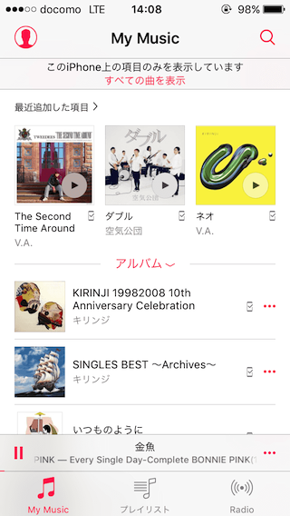
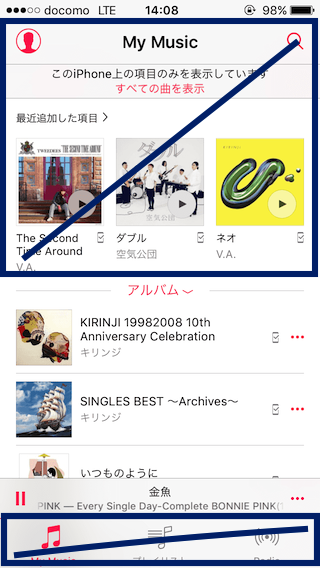
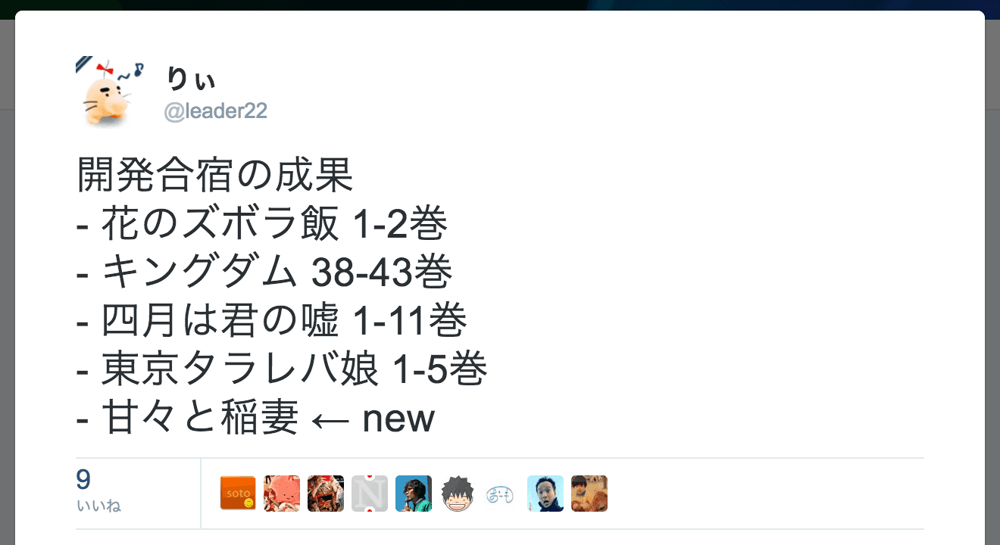

title: React NativeでiOSアプリ作った
controls: false
--

# React Nativeで iOSアプリ作った
## 2016/10/02-04 PixelGrid Inc. 開発合宿 in 浜金谷

--

# モチベーション

--

### iOSのミュージックアプリが💩

- 本当に💩
  - OSのバージョンアップの度に💩度が増す
- プレイリストとかいらん
  - AppleMusicとか使わん
  - レートとかつけない
  - 勝手にアートワーク変えるな

※個人の感想です

--

## 
## トップだと

--

## 
## 使ってない部分のほうが多い

--

## 
## [leader22/SimpleMusicPlayer](https://github.com/leader22/SimpleMusicPlayer)

--

# 合宿での学び

--

### ワタシ、Swift チョットデキル

- https://github.com/leader22/SimpleMusicPlayer/blob/master/ios/MPMediaManager.swift
- 見慣れないSyntax
- 慣れない言語仕様
- 型

--

### iOS モ チョットデキル

- いちおうアプリとして動いてるし
- XCodeが最初は難しい
- 何をコミットすればいいのか
- なおドキュメントは綺麗に包装された💩

※個人の感想です！

--

### React Native チョッ(ry

- 使い所が難しい
- Native機能を使うならSwiftでやれ
- 使わないならWebでやれ
- そしてドキュメントが💩
  - Swiftだと書いてないことも多い
  - 古くて動かないやつとか

※個人の感想です！！

--

# React Nativeの つらかった点

--

### プリミティブ値しかやりとりできない

- アルバムのアートワークをどうやって連れてくるか
- Swift側ではもちろん`UIImage`
- js側に渡すなら、base64で`String`にするしかない
- アートワークは曲ごとに設定されてる
  - ＼Received memory warning／
  - ＼Received memory warning／
  - 😇

=> それ用に`Map`作って最低限だけ連れていく。

--

### 標準のUIコンポーネントがダサい

- ListViewとかTabBarとかは確かに便利
- ただしSliderとかはおしゃれなデザインにしたい
  - できない・・

=> 先駆者が公開してるものを探す or 自作

--

### コンポーネントの自作つらすぎる問題

- `<Animated />`ってのがある
- ただ全部作らないといけないので本当に面倒くさい
- なんのためにReact Native・・？という気持ちに

=> GitHubを検索しまくる or ダサさを受け入れる

--

### Native機能を使うとコンパイル待ちが

=> 最終的に1分弱もかかるなら仕方ないね

--

# おわりに

--

### Webやりましょう
- ともに育った`div`の元へ帰ろう
- 自由度の高いレイアウトが可能な`CSS`
- 慣れ親しんだ`JavaScript`

Web最高！！

--

### ちなみに
- インストールしてみたい人いますか？
- ただどうしても直せなかった不具合がある・・

--

### Links
- [leader22/SimpleMusicPlayer](https://github.com/leader22/SimpleMusicPlayer)
- [このスライド](http://leader22.github.io/slides/pxg_camp-2016b)
- [ブログに書いた知見記事たち](http://lealog.hateblo.jp/search?q=%22react+native%22)

--

# Finish!

<link rel="stylesheet" href="./style.css">

