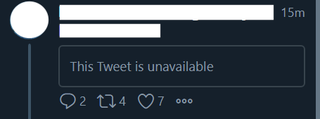
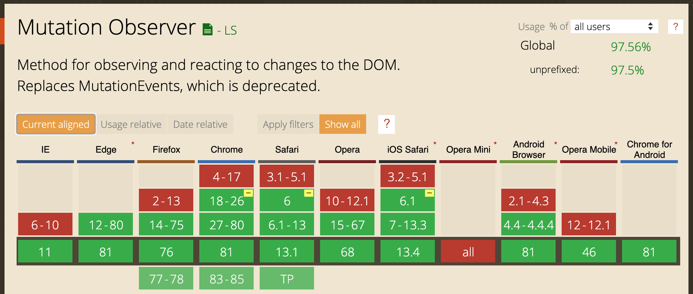

# The `MutationObserver` API
2020/05/20 LT at PixelGrid Inc.

---

# About me

---

## About me 1/2

- Yuji Sugiura
- NTT Communications
  - Web Engineer
  - ~2020/06/30


---

## About me 2/2

- Twitter: [@leader22](https://twitter.com/leader22)
- GitHub: [leader22](https://github.com/leader22/)
- Blog: [console.lealog();](https://lealog.hateblo.jp/)


---

# Today's theme 👉 `MutationObserver`

---

## `MutationObserver` interface

provides the ability **to watch for changes being made to the DOM tree**.

```js
// Create observer instance
const mo = new MutationObserver(changes => {
  for (const change of changes) {
    console.log(change);
  }
});

// Observe it
mo.observe($target, { attributes: true });
```

https://developer.mozilla.org/en-US/docs/Web/API/MutationObserver

---

# My motivation

---

## The world's worst UX ever

- 🤢
- How can I cope with this?



---

## Browser extension to the resucue!

- Extension to remove tweets include unavailable contents
- Run it on
  - initial page loaded
  - new tweets added
- 🤗

---

## Problems 🤔

- How to detect page is loaded?
  - `DOMContentLoaded` is not suitable for SPA
  - `setTimeout()` works but flaky
- How can I detect new tweets are added?
  - count all tweets...?
  - use Timers...?

---

## Use `MutationObserver`!

- How to detect page is loaded?
  - observe `$el` for timeline has shown up
  - or `$el` for loading has been hidden
- How can I detect new tweets are added?
  - observe `$el` for timeline and its child nodes

---

# About `MutationObserver`

---

## `MutationObserver` IDL

```java
[Exposed=Window]
interface MutationObserver {
  constructor(MutationCallback callback);

  void observe(Node target, optional MutationObserverInit options = {});
  void disconnect();
  sequence<MutationRecord> takeRecords();
};

callback MutationCallback = void (sequence<MutationRecord> mutations, MutationObserver observer);

dictionary MutationObserverInit {
  boolean childList = false;
  boolean attributes;
  boolean characterData;
  boolean subtree = false;
  boolean attributeOldValue;
  boolean characterDataOldValue;
  sequence<DOMString> attributeFilter;
};
```

https://dom.spec.whatwg.org/#mutationobserver

---

## `MutationObserverInit` 1/2

- The `options` for what to `observe()`
- Basic mutation types
  - `childList`
  - `attributes`
  - `characterData`

```js
// At least one of these options must be true
{ childList: true }
{ atributes: true }
{ characterData: true }
```

---

## `MutationObserverInit` 2/2

- Additional options can be combined

```js
// Deep-observe
{ childList: true, subtree: true }
{ characterData: true, subtree: true }

// Need previous value
{ atributes: true, attributeOldValue: true }
{ characterData: true, characterDataOldValue: true }

// Specify which attrs to track
{ /* atributes: true, */ attributeFilter: ["href", "name"] }
```

---

## `MutationRecord`

- Mutations are enqueued on microtask and notified as records

```js
const mo = new MutationObserver(mutationRecords => {
  for (const record of mutationRecords) {
    switch (record.type) {
      case "childList": {
        // ...
      }
      case "attributes": {
        // ...
      }
      case "characterData": {
        // ...
      }
    }
  }
});
```

---

## `MutationRecord` IDL

- It depends on init `options`

```java
[Exposed=Window]
interface MutationRecord {
  readonly attribute DOMString type;
  [SameObject] readonly attribute Node target;
  [SameObject] readonly attribute NodeList addedNodes;
  [SameObject] readonly attribute NodeList removedNodes;
  readonly attribute Node? previousSibling;
  readonly attribute Node? nextSibling;
  readonly attribute DOMString? attributeName;
  readonly attribute DOMString? attributeNamespace;
  readonly attribute DOMString? oldValue;
};
```

https://dom.spec.whatwg.org/#mutationrecord

---

## Finally 👏🏻

> Chrome extension to remove **annoying** unavailable tweets for TweetDeck.
> https://gist.github.com/leader22/ae082ddc8d6296a681ddef51520d88da

---

## We can use!


https://caniuse.com/#feat=mutationobserver

---

## Usecases

- Wait dom element ready
  - Resolve `Promise` if target element found
- User tracking
  - Do not need to inject trackers into app codes
- etc...

---

# Thanks!
