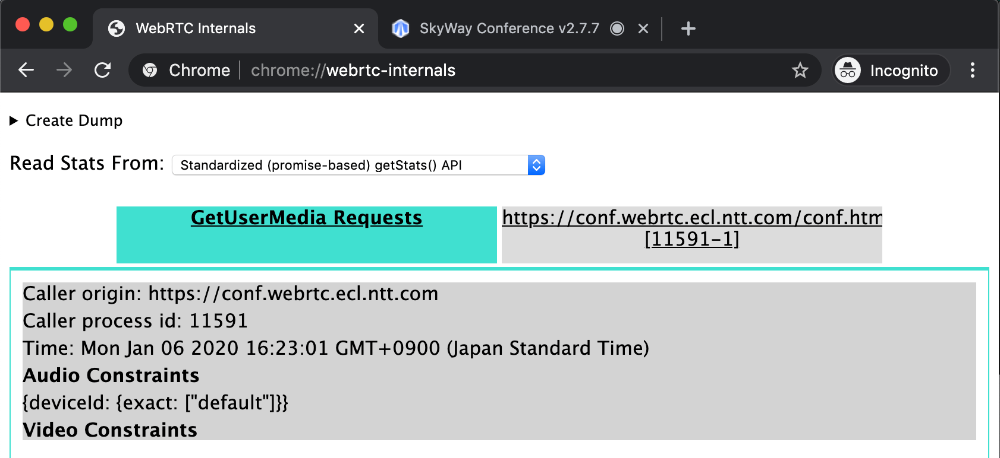
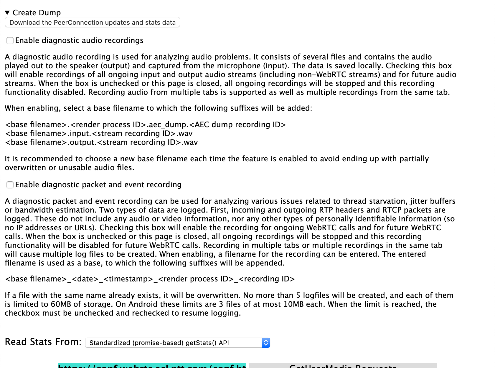
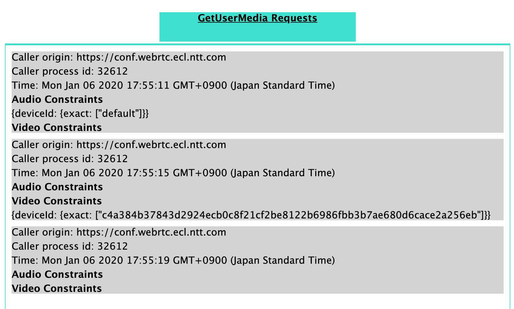
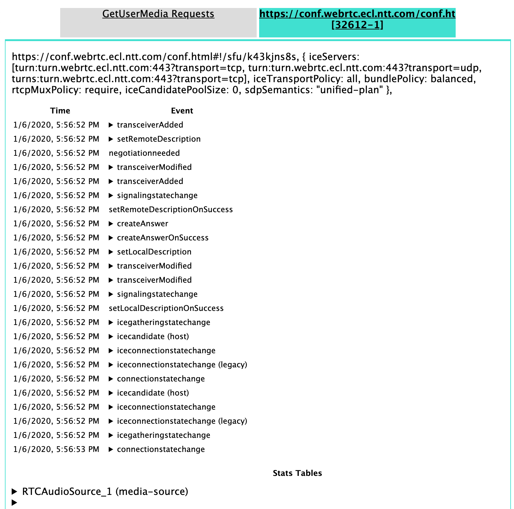
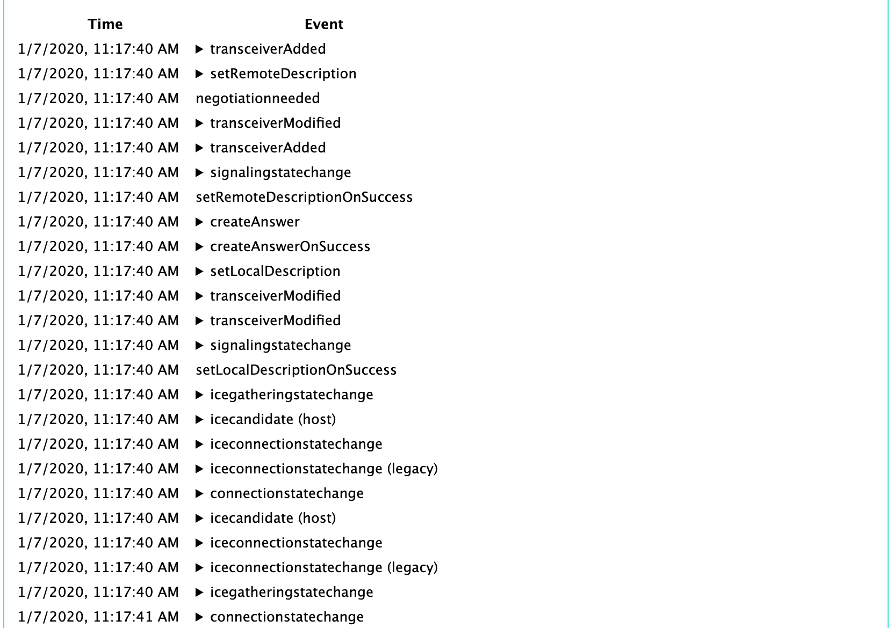
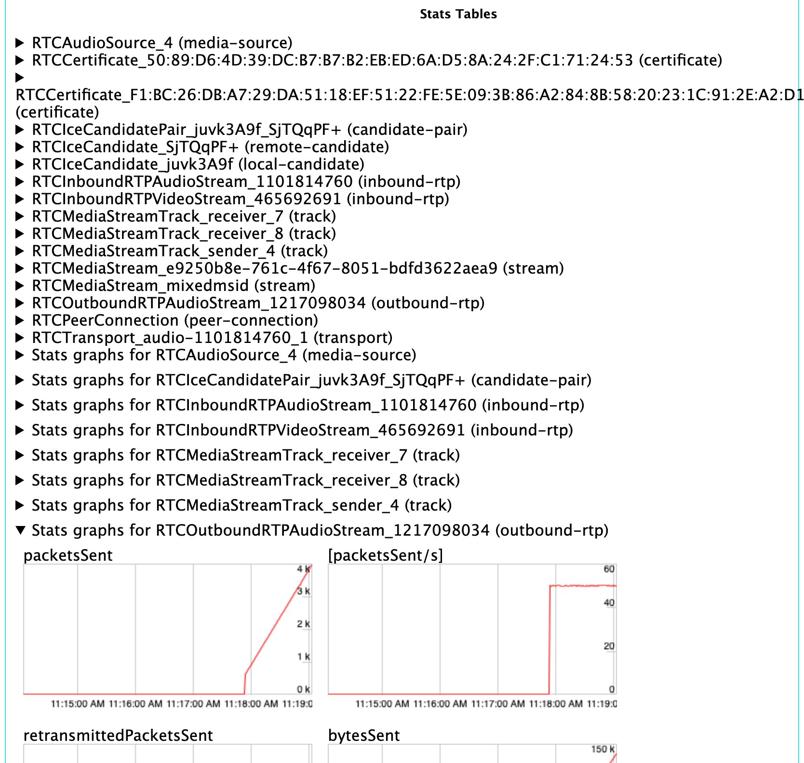
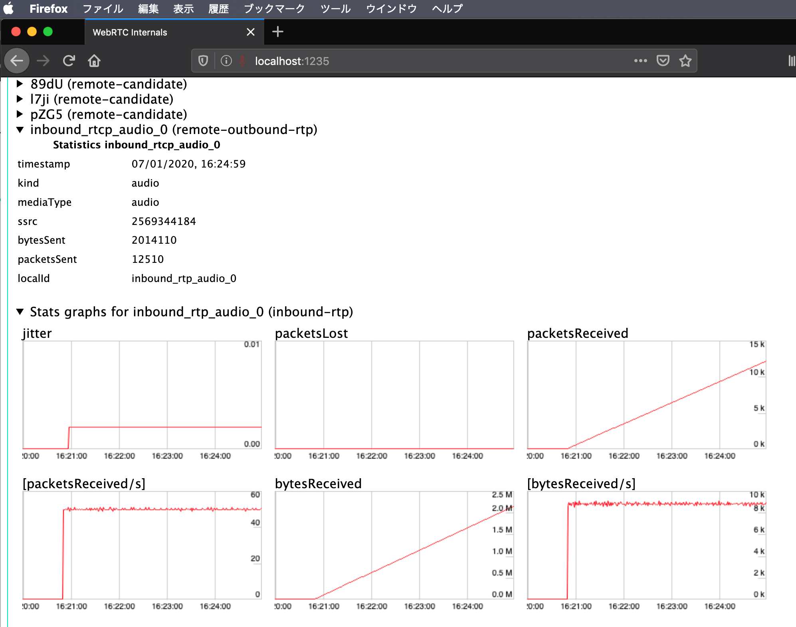

# The `chrome://webrtc-internals` internals
2020/01/15 SkyWay UG Tokyo #6

---

## About me 1/2

- Yuji Sugiura
- NTT Communications
  - Front-End Developer
  - (work at SkyWay)


---

## About me 2/2

- Twitter: [@leader22](https://twitter.com/leader22)
- GitHub: [leader22](https://github.com/leader22/)
- Blog: [console.lealog();](https://lealog.hateblo.jp/)


---

# Today's theme

---

## chrome://webrtc-internals


---

## What's this?

- The special✨page which tracks WebRTC API usage
  - `navigator.mediaDevices.getUserMedia(constraints)`
  - （`navigator.mediaDevices.getDisplayMedia(constraints)`）
  - `new RTCPeerConnection(configuration)` and its details
- 🥇: Available in Chrome
  - 🥈: Firefox has `about:webrtc`
  - 🥉: Safari has only logger function for DevTools
- It is special, but just a **Web page**

---

## If it's just a web page

- We can debug it w/ Chrome DevTools😻
- And done!

---

# Overview (if needed)

---

## Components

1. Header
2. Tab: for GetUserMedia Requests（always 1）
3. Tab: for PeerConnection（N pc）

---

# 1. Header



---

## Dump downloader

- PeerConnection updates and stats（`.txt`, JSON format）
  - Exports how current session progress
  - Dump now, diagnose later
- Audio（`.wav`） recording
  - Input from microphone
  - Output from speakers
- Packets and event logs（`.log`）
  - incoming & outgoing RTP headers
  - RTCP
  - Format is Protocol Buffers...?

---

## Version settings

- For `getStats()` format
  - Standard or legacy format
  - Use default（`Standarized(promise-based)`） is better

---

# 2. Tab: GetUserMedia Requests



---

## Track `getXxxMedia()`

- `navigator.mediaDevices.getUserMedia()`
  - When
  - Where(URL)
  - How(constraints)
- `navigator.mediaDevices.getDisplayMedia()`
  - It also appears
  - But information is missing...🤔

---

# 3. Tab: PeerConnection



---

## `RTCPeerConnection` 1/3

- For each `new RTCPeerConnection()` instance
- How does it created(`RTCConfiguration`）
  - Use TURN or NOT
  - Use BUNDLE or NOT
  - etc..

---

## `RTCPeerConnection` 2/3



- Time-based events list
  - Media added/removed/changed
  - State changed
  - Candidate found
  - SDP Offer/Answer
  - etc..

---

## `RTCPeerConnection` 3/3



- Various data from `getStats()`
  - How many medias there
  - Which codec used
  - Which candidates are used
  - Bandwidth usage
  - etc..
- By tables and graphs

---

# About inside

---

## Single Page Application

- `webrtc-internals.html`
  - HTML + inline CSS
  - Empty `<div />` for SPA
  - Just loads 2 JavaScript files below
- `util.js`
  - Utility functions
  - Only available under `chrome://` urls
  - Do not care this time
- `webrtc_internals.js`
  - Today's main dish
  - 3000 lines😇

---

## I wanna know...

- Where does data come from?
  - JavaScript should handle everything
  - Anybody send it
- Chrome has special APIs for that?
  - Secret REST API
  - Secret global function
- Maybe we can use it..?
  - my custom internals!
- Read all 3000 lines💪
  - https://gist.github.com/leader22/a7e8db88a5fb304be4e45b73424a1ff5

---

## Did it!

> [chrome://webrtc-internals のしくみ - console.lealog();](https://lealog.hateblo.jp/entry/2020/01/07/100402)

---

# Analysis result

---

## Breakdown of 3000 lines

- 01%: Initialization
- 03%: Global variables, functions definition
- 04%: For Tab UI
- 05%: For Dump import/export
- 05%: PeerConnection events list
- **82%**: PeerConnection Stats visualization（table + graph）

---

## Data comes from

- Browser itself(C++)
  - No APIs we can touch😨
- Invoke `chrome.send(evName)` in JavaScript to signal
  - Available only under `chrome://` pages
  - by manual, by timers
- Browser(C++) responds it
  - e.g. Then correct active `RTCPeerConnection`
  - e.g. Get `RTCStatsReport`
  - Then invoke corresponding global function w/ data

---

## Process data

- Data is processed and stored in JavaScript
  - `window.userMediaRequests`
  - `window.peerConnectionDataStore`
  - Dumps = `JSON.stringify()` these
- Graphs are `canvas` elements
  - Not real-time, timer calls by 1 sec
- Almost all of 3000 lines are for Graphs
  - Various class definitions for various metrics
  - There are many lines not used anymore

---

## Starting point: `addStandardStats()`

- When this is invoked, the graphs are rendered 1 frame
  - by timer, 1 sec interval
- Comment says like below...
  - a little?😑

```js
// |internalReports| is an array, each element represents an RTCStats object,
// but the format is a little different from the spec. This is the format:
// {
//   id: "string",
//   type: "string",
//   stats: {
//     timestamp: <milliseconds>,
//     values: ["member1", value1, "member2", value2...]
//   }
// }
```

> https://github.com/chromium/chromium/blob/master/content/browser/resources/media/stats_rates_calculator.js#L95-L104

---

## If you cope with it



- `webrtc-internals` can run on Firefox🦊
- Or rather, if you have `getStats()`...
  - With Safari
  - With Native SDKs
  - or...!

---

# Summary

---

## The `chrome://webrtc-internals` is

- Usefull
- Just a web page, but special page
- Should help when making my own stats viewer

---

## About `getStats()` itself

- Compatibility issues are still there...
  - I can talk several times with just that
- Let's talk later if you interested🍻

---

# Thank you!
