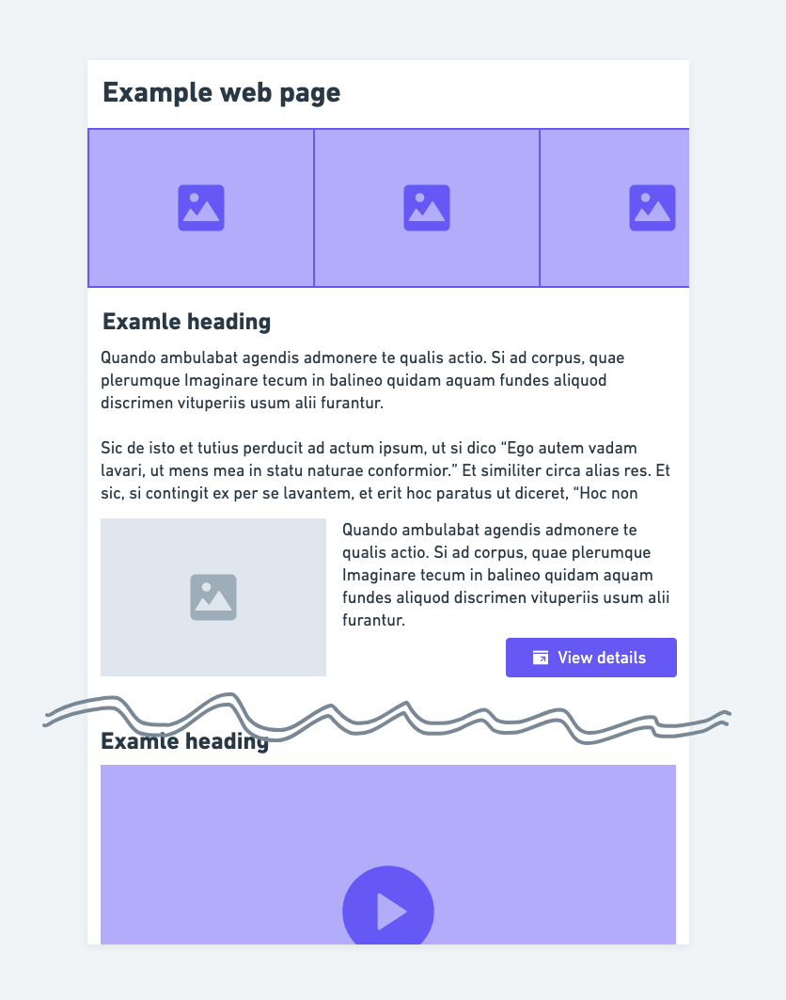
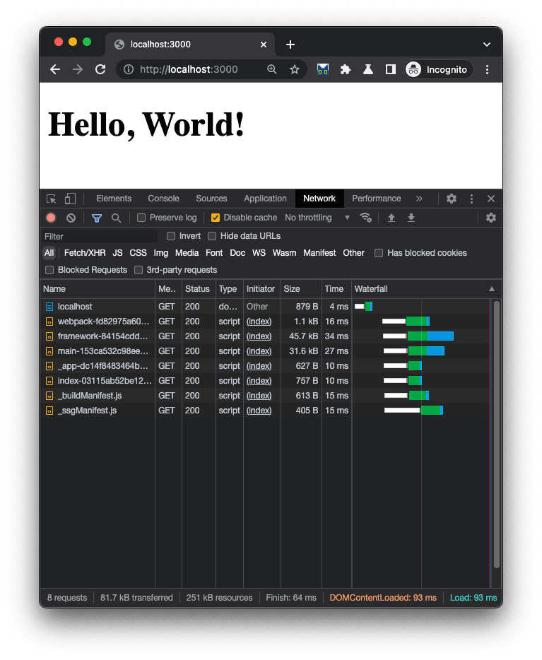
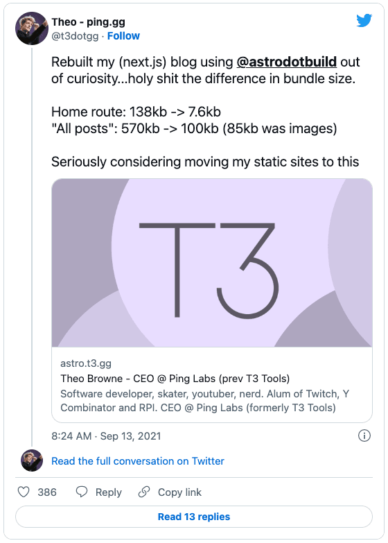

# The islands architecture recap
2022/09/21 Techfeed Experts Night #4

---

# About me 👋

---

## Yuji Sugiura

- PixelGrid Inc.
  - Senior Engineer


---

## りぃ / @leader22

- Twitter: [@leader22](https://twitter.com/leader22)
- GitHub: [leader22](https://github.com/leader22/)
- Blog: [console.lealog();](https://lealog.hateblo.jp/)


---

# Today's theme

---

# Islands architecture 🏝


---

## TL;DR

- Page consists of **static ocean**🌊 and **dynamic islands**🏝
  - Static: Layouts, texts, images, etc...
  - Dynamic(w/ JS): Carousel, Popup, VideoPlayer, etc...
- Page is (pre-)rendered on the server
  - !== SPA
- Dynamic islands are become interactive on the client
  - Hydrated with rendered HTML
  - Multiple entries, small apps



---

# Why? 🤔

---

## Static >= Dynamic

- Most web pages consist of **static contents** and **dynamic contents(requires JS)**
- Generally the static contents are more than you think

Of course, it depends on the situation. You may need a SPA 😌


---

## Concerns about modern frameworks

- Recent frameworks(SPA in mind) treat everything as dynamic by nature
  - Single entry, large app
- This means that a large amount of JS must be downloaded, parsed, and executed 💨
  - Includes framework itself, templates already rendered, hydration things, etc...
  - Even if pre-rendering(SSG mode)
  - Even if page is 100% static 🙄

It leads slow page load, waste bandwidth, and also slow TTI.



---

## (Full) Hydration is pure overhead

- Hydration is top-down process with no priority
  - Carousel at the top should become interactive immediately
  - But, why should we load (and wait) the video player at the bottom?
- We don't need useless JS in the first place!
  - You may not need a SPA, but even with a MPA, extra JS should be avoided
- 🤖 Always imagine poor mobile device on slow network

I wish I could use minimum JS when the time I need it?

---

# Islands architecture<br>🤝<br>Partial hydration


---

## Partial hydration to the rescue 🚒

Instead of full(page-level), why not perform partial(component🏝-level) hydration?

- Minimum size of JS are used
  - 0-JS by default 👌
- Non-blocking, isolated hydration in parallel 🔀
- Bonus: Lazy loading + hydration ✨
  - With `requestIdleCallback()`
  - When visible w/ `IntersectionObserver`
  - On `mouseenter`, `touchstart`
  - etc...

Various islands architecture oriented frameworks implement these features!

---

## Modern progressive enhancement?

```html
  <!-- Server rendered HTML here -->
  <script>
    $("#js-carousel").carousel({ speed: 500 });
    $("#js-popup").popup();
    $("#js-video-player").player("https://...");
  </script>
</body>
```

At that time, it took a lot of effort to cope with. 🤣

- HTML was handwritten, server and client templates are doubled
- Manual execution timing management
- Mount multiple Apps with complicated build steps
- Web Components had SSR issues

But now in 2022, sophisticated frameworks do it better with nice DX.

---

# Try it out!


---

## Choose your starter!

- Astro: https://docs.astro.build/en/concepts/islands/
- 11ty: https://www.11ty.dev/docs/plugins/partial-hydration/
- Slinkity: https://slinkity.dev/docs/partial-hydration/
- Iles: https://iles-docs.netlify.app/guide/hydration
- Elder.js: https://elderguide.com/tech/elderjs/#partial-hydration
- Marko: https://markojs.com/#hydration
- Tropical: https://github.com/bensmithett/tropical-utils/tree/main/packages/tropical-islands
- Fresh(for Deno): https://fresh.deno.dev/docs/getting-started/adding-interactivity

Maybe more to come! 🦄

---

## Example code w/ Astro

```html
---
import Layout from "../components/layout.astro";
// ...
import VideoPlayer from "../components/video-player.jsx";
---

<Layout>
  <Header />
  <Carousel speed={500} client:load />
  <Details>
    <Popup client:idle />
  </Details>
  <!-- ... -->
  <Media>
    <VideoPlayer src="https://..." client:visible />
  </Media>
  <Footer />
</Layout>
```

Looks familiar to you?

---

## User's voice w/ Astro



> Rebuilt my (next.js) blog using @astrodotbuild out of curiosity...holy shit the difference in bundle size.
>
> Home route: 138kb -> 7.6kb
> "All posts": 570kb -> 100kb (85kb was images)
>
> Seriously considering moving my static sites to this

https://twitter.com/t3dotgg/status/1437195415439360003

---

# Thank you!

---

## References 📚

- About architecture
  - [Modernizing Etsy’s codebase with React featuring Katie Sylor-Miller (JS Party #105) |> Changelog](https://changelog.com/jsparty/105)
  - [Islands Architecture - JASON Format](https://jasonformat.com/islands-architecture/)
  - [Islands Architecture - patterns.dev](https://www.patterns.dev/posts/islands-architecture/)
- Benchmarks
  - [BuilderIO/framework-benchmarks: Test each framework for it's performance cost](https://github.com/builderio/framework-benchmarks)

---

# Go 1 step further?

---

## Qwik

- https://qwik.builder.io/
- No hydration, resumable
- Lazy loading **everything**
  - Load only (what|when) you need

You should definitely try! 😻 https://qwik.builder.io/examples/introduction/hello-world/


