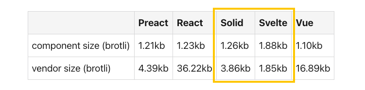

# X ways to reduce your JS
2022/12/14 UIT Meetup #18

---

# About me 👋

---

## Yuji Sugiura

- PixelGrid Inc.
  - Senior Engineer
- 👨‍👩‍👧


---

## りぃ / @leader22

- Twitter: [@leader22](https://twitter.com/leader22)
- GitHub: [leader22](https://github.com/leader22/)
- Blog: [console.lealog();](https://lealog.hateblo.jp/)


---

# Today's theme

---

# Reduce your JavaScript!


---

## The numbers are increasing

- Top 1,000 sites
- 2017/12/15 - 2022/10/01

From [httparchive.org](https://httparchive.org/reports/state-of-javascript?lens=top1k&start=2017_12_15&end=latest&view=grid)


---

## But...

- 30 - 40% are unused 🥺
  - https://web.dev/unused-javascript/

From [Web Almanac](https://almanac.httparchive.org/en/2022/javascript#how-much-javascript-do-we-load)


---

## The problems

Too much, unused JS,

- slow down entire page loading
  - whether blocking or not
- consume extra network bandwith, waste mobile data costs

This trend makes the Web slower... 🐌

---

### Even worse

If DOM is rendered dynamically(CSR) _for no reason_,

- require more time and resource **after** JS are loaded
- may be less accessible on slow network, low-spec device
- even with SSR, still cause UI jank
- open in new tab run the same process again

Is your JS really needed...?

---

## JavaScript bloat 😬

> JavaScript bloat refers to a website that relies on too much JavaScript to function at peak speed and capacity.
>
> A feature-rich, complex website is naturally going to have more JavaScript, and that’s OK.
> The problem happens when **a simple site has a large amount of JavaScript** that the user must download.

https://builtin.com/software-engineering-perspectives/fix-javascript-bloat


---

# Let's reduce JS!

for better UX, faster Web ✨


---

## X. Use HTML elements properly

- `<details>` + `<summary>` for (open|close) toggle menu
- `<dialog>` for (modal|modeless) dialog
  - a11y support included 🤩
- `<datalist>` for incremental search
- `<form>`
  - with `<input type="range|color|date|month|...">`
  - and attrs like `required`, `pattern`, ...

See also https://developer.mozilla.org/docs/Web/HTML/Element

---

## X. Use Web Standard APIs

- The same as https://youmightnotneedjquery.com
- Instead of `EventEmitter`
  - `MessageChannel`, `EventTarget`
- Instead of Luxon, Day.js
  - `Intl.DateTimeFormat`
- Instead of clipboard.js
  - `navigator.clipboard`

See also https://developer.mozilla.org/docs/Web/API

---

## X. Misc

- USE! CSS! FIRST!
  - for spacing
  - for transition, animation
  - for smooth scroll
  - for variables, constants
  - etc...
- FYI: View Transitions API
  - https://github.com/WICG/view-transitions/blob/main/explainer.md#mpa-vs-spa-solutions

---

## X. Optimize build

- Refine build target defined in `.babelrc`, `tsconfig.json`, `vite.config.js`, etc...
  - ~~IE? still alive?~~
- Do not forget to minify
- Reconsider, optimize CSS-in-JS solutions
  - to extract `.css` files
  - you might not need Autoprefixer anymore
- Move `<svg>` icons out from JS
  - use `<defs>` + `<use>`

---

## X. Try precompiled disappearing FWs

- Like [Svelte](https://svelte.dev/)([Kit](https://kit.svelte.dev/)), [Solid](https://www.solidjs.com/)([Start](https://start.solidjs.com/))
- Declarative components as usual turn into optimized runtime! 👻
  - no V-DOM overhead
  - (relatively) small and efficient

From [TodoMVC size comparison](https://dev.to/this-is-learning/javascript-framework-todomvc-size-comparison-504f)



---

### Inflection points

- (N * TodoMVC) + vendor size(↑)
- Inflection points(↓)

>  From 0-3 TodoMVCs, Svelte is the smallest. From 3 to 10 Solid is the smallest. 10-113 TodoMVCs Preact is. And more than 113 TodoMVC's Vue is.

(Just for reference. 🙈)


---

## X. Consider pre-rendering

- Use SSG(static site generator), instead of CSR(+SSR)
  - ≠ `next export`
- Render every pages and contents beforehand
- A.k.a. [Jamstack(-y)](https://almanac.httparchive.org/en/2022/jamstack#jamstack-y-a-disclaimer) approach
- Suitable for blog, document, company site, etc...

Base line is 0 JS!

---

## X. Stick with Server rendering

- Use classic web server and templates
  - ≠ SSR
- Render every pages and contents on the fly
  - authenticate, personalize
- CDN Edge Workers are also available in these days
  - e.g. Cloudflare Workers

Base line is also 0 JS!

---

## X. Adopt MPA style

- Separate page(app)s by use-case
  - e.g. (Login app | Main app), (User app | Admin app)
  - As you do dynamic `import()`, async routes
- Separete truly static pages
  - ≠ `next export`

Separation of concerns! ✂️

---

## X. Visit islands architecture

- Like [Astro](https://astro.build/), [Marko](https://markojs.com/)
- Pre-rendering static contents
  - or streaming SSR(in-order)
- Lazy load+hydrate dynamic component JS

See also [The islands architecture recap](https://leader22.github.io/slides/techfeed_experts_night-4/)


---

### Full hydration

```html
<!-- React component code example.
     All components are loaded, parsed, hydrated on page load -->
<Layout>
  <Header />
  <Carousel speed={500} />
  <Details>
    <Popup />
  </Details>
  <!-- ... -->
  <Media>
    <RichVideoPlayer src="https://..." />
  </Media>
  <Footer />
</Layout>
```

Maximum size of JS are always used regardless of its usage.


---

### Partial hydration

```html
<!-- Astro component code example.
     Components w/o `client:*` are statically pre-rendered -->
<Layout>
  <Header />
  <!-- JS loaded+hydrated on page load -->
  <Carousel speed={500} client:load />
  <Details>
    <!-- Same as above but with `requestIdleCallback()` -->
    <Popup client:idle />
  </Details>
  <!-- ... -->
  <Media>
    <!-- JS loaded+hydrated when entering a viewport -->
    <RichVideoPlayer src="https://..." client:visible />
  </Media>
  <Footer />
</Layout>
```

Minimum size of JS are used and only when it's needed. 🏝


---

### Astro client directives

- `client:load`: Immediate
- `client:idle`: With `requestIdleCallback()` (= lower priority)
- `client:visible`: With `IntersectionObserver`
- `client:media`: With `MediaQueryList` by `matchMedia()`
- `client:only`: Immediate but skip SSR

https://docs.astro.build/en/reference/directives-reference/#client-directives

---

## X. No hydration, resume it quickly

- [Qwik](https://qwik.builder.io/)([City](https://qwik.builder.io/qwikcity/overview/))
- Everything is lazy loadable
  - even at event handler level!
  - PH can only perform at component(and its whole children) level
- Simply **resume** the flow that done on server
  - (P)H **repeat** the flow that done on server

Base line is close to 0 JS, order is _N(1)_ constantly. 🤯

---

### Qwik in action

- 0 JS on initial load
  - bootstraps are inlined in HTML
- Load minimum chunks progressively by user action

https://todo-cloudflare-misko.sethealth.workers.dev


---

### Qwik component code

```jsx
const Counter = component$(async () => {
  const state = useStore({ count: 0 });

  return (
    <button onClick$={() => { state.count++; }}>
      {state.count}
    </button>
  );
});
```

- JSX as you have seen in React, Solid
- [`$`](https://qwik.builder.io/docs/advanced/dollar/) means _boundary_ as a qwik symbol
  - can be extracted for lazy, progressive loading

---

# Summary


---

## Smaller is better

> A feature-rich, complex website is naturally going to have more JavaScript, and that’s OK.

Of course it depends, but ship less code is better.

> The problem happens when **a simple site has a large amount of JavaScript** that the user must download.

Let's make the Web faster! 😌

---

## Everything is a trade-off

Size is not the only aspect to determine UX.

- Performance is also indispensable
- DX, eco-systems affect iteration cycles

Seeking for a better UX, that is what front-end development is all about. 🐈

---

# Thank you!
