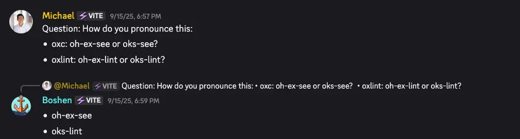

<style>
:root {
  /* # H1 */
  --h1-color: #2c3e50;
  --heading-strong-color: #27ae60;
  /* Normal block */
  --bgColor-default: #fafafa;
  --fgColor-default: #2c3e50;
  --fgColor-accent: #27ae60;
  /* Code block */
  --borderColor-default: #007f62;
  --bgColor-muted: #f5f5f5;
  --fgColor-muted: var(--color, --fgColor-default);
  /* Misc. */
  ::selection {
    background-color: #3498db;
    color: #ffffff;
  }
}
</style>

# Contributing to **OSS**, Reflecting on **OXC**

2025/10/25 VueFes Japan 2025

---

## Hello! 👋🏻

---

### Today's theme

Personal reflection as an **OSS** contributor to the **OXC** project:

- What kind of contributions have I made?
- What was I thinking while contributing?

I'll touch on technical aspects, but I'd also like to talk about other things as well.

Submitted approximately [200 PRs](https://github.com/pulls?page=1&q=is%3Apr+author%3Aleaysgur+org%3Aoxc-project+created%3A%3C2025-09-01+sort%3Aupdated-desc+is%3Aclosed) between 2024/01/01~2025/08/31.

---

### What is OXC?

> The JavaScript Oxidation Compiler ⚓️
> https://oxc.rs

A set of tools for JS/TS written in **Rust**.

- https://crates.io/crates/oxc
- https://crates.io/crates/oxc_parser
- https://crates.io/crates/oxc_transformer
- https://crates.io/crates/oxc_resolver
- etc...

It covers almost [everything](https://crates.io/users/Boshen?sort=recent-updates)!


---

### What is OXC?

More broadly, provided as various tools that leverage its performance:

- [`oxc-parser`](https://www.npmjs.com/package/oxc-parser): 3x faster than SWC (which is already considered fast)
  - See https://github.com/oxc-project/bench-javascript-parser-written-in-rust
  - (TS)ESTree AST compatible!
- [`oxlint`](https://www.npmjs.com/package/oxlint): 50-100x faster than ESLint
  - See https://github.com/oxc-project/bench-javascript-linter
  - 🆕 Now supports [`--type-aware`](https://oxc.rs/blog/2025-08-17-oxlint-type-aware.html) linting
  - 🆕🆕 Finally supports [`jsPlugins`](https://oxc.rs/blog/2025-10-09-oxlint-js-plugins.html)
- And more to come...

It's also used internally by [Rolldown](https://github.com/rolldown/rolldown), which is the core of the next version of [Vite](https://github.com/vitejs/rolldown-vite).

---

### PROTIP 💡



---

## Before and after my 1st PR 🌅

---

### Me and Rust 🦀

- As a front-end engineer, I never use Rust at work
  - I had expectations (~~or hopes~~) that I might use it with WASM
- The language only used for [LeetCode](https://leetcode.com) in my free time and [Advent of Code](https://adventofcode.com) at the end of each year
  - Repeating the cycle of learning <-> forgetting for 3 years. 🤯

In the fall of 2023, I realized that contributing to OSS might be the best way to learn it.

---

### Me and OSS

- I'm not a total newbie 😇
- Occasionally submit PRs, participate in discussions on issues
- I also publish and maintain my own OSS projects

I've been following the trends of well-known OSS projects that I use at work for a long time, but I've never had the experience of being deeply involved in a specific OSS project.

---

### a.k.a. "半年ROMれ"

- OXCというプロジェクトの盛り上がりは知ってて、興味はあった
  - しかし、何から始めたらいいのか
  - どこに貢献の余地があるのかわからない
  - Rustが得意というわけでもない
- なので、すべてのIssue/PRをwatchして、ひたすら観察していた
- PRはせずにコードを書いてみて、他の人のマージされたPRと答え合わせしたり

> Lurk Moar | Know Your Meme
> https://knowyourmeme.com/memes/lurk-moar

---

### メンテナの人たちに迷惑をかけたくない

- 郷に入っては郷に従う・・・ためにも、まずは知るところから
  - どういうIssueの優先度が高いのか
  - 過去にcloseされるIssue/PRの経緯や理由、作法など
  - どういう人が活動してるか（担当領域や生活タイムゾーンとか）
  - どこなら他の人の作業と競合しなさそうか
- コードに対する作法も、それ以外のことも学べる
  - `Good first issue`や`Help wanted`ラベルがあることとか
  - PRごとにベンチマークが走るほど、パフォーマンスを意識してるとか
  - たとえばTSの型情報は使えないので、対応できない場合もあるとか

㊗️ 2023/12: `oxlint`の[GA](https://oxc.rs/blog/2023-12-12-announcing-oxlint.html)がアナウンス

---

### 2024/01: My first PR

> feat(tasks): Add eslint-plugin-jsdoc rulegen by leaysgur · Pull Request #1965 · oxc-project/oxc
> https://github.com/oxc-project/oxc/pull/1965

Linterのルール実装・・・の、テンプレート生成コマンドを追加しただけ。

ちなみにこの時、`eslint-plugin-jsdoc`のルール実装に挫折したと書いてあった 🥹

---

### `tasks/lint_rules` CI

- プラグインごとのルール実装の進捗を[可視化](https://github.com/oxc-project/oxc/issues/684)するCIタスク
  - ESLintプラグインをローカルインストールし、Rustのコードを文字列パースした結果と比較するGitHub Actions
- このタスクはRustではなくJSで書いた
  - 某プラグインがルール一覧をJSで動的に定義してて、Rustではパースできなかったので


---

### コードを書くだけがOSS貢献ではない

- Rustを書かなくても、Rustのプロジェクトに貢献できることもある
- 実は、他にもそういう機会は転がってる
  - Playground: https://github.com/oxc-project/playground
  - Docs: https://github.com/oxc-project/oxc-project.github.io

というか、Issueにコメントするだけでも、[Discord](https://discord.com/invite/9uXCAwqQZW)で会話するだけでも、使用感や調査結果をポストするだけでも、それは立派なOSS contributionになる！

---

## VS JSDoc 🏺

---

### Pandora's Box

> feat(ast,parser): parse jsdoc · Issue #168 · oxc-project/oxc
> https://github.com/oxc-project/oxc/issues/168

- 2023年末からずっと放置されてたIssue
  - Issueページの最後尾に長らく埋まっていた
- 当初は軽い気持ちで開けた
  - 誰もやらない = じっくりRustが学べるのでは？
  - 挫折した`eslint-plugin-jsdoc`のリベンジ
  - 仕事でJSDoc TSもよく使ってたし、なんとなくできる気がした

誰も触らない理由をすぐに知ることになる・・・ 😇

---

### All about JSDoc

```js
/** @type {string} myName */

/************************************
 * @you    @also       @your    @tag
 *     @can     @create     @own

   @omg */
```

- `*`からはじまる複数行コメントに
- `@tag`を書いて自由に意味を持たせられる
- 仕様は決まってない

仕様は決まってない！（大事なことなので2回）

---

### コメントは誰のもの？

```js
/** `const`, `x` or arrow function? */
const x = () => {};

// Do you remember Flow?
function method(param /*: string */) /*: number */ {
  return 1;
}
```

コメントとASTの対応は、ESTreeでも定義されてない微妙な扱いのトピック。
どこにでも書けるし、改行やスペースの考慮も必要になる。

> Standardize Comment Types · Issue #201 · estree/estree
> https://github.com/estree/estree/issues/201

---

### `eslint-plugin-jsdoc`: `tagNamePreference` option

```json
"jsdoc": {
  "tagNamePreference": {
    "param": "arg",
    "returns": "return"
  }
}
```

- 任意の名前で、タグをエイリアスできる[オプション](https://github.com/gajus/eslint-plugin-jsdoc/blob/main/docs/settings.md#alias-preference)がある
- つまり、ESLintの設定がわからないと、パーサーで静的にパースできない

こうなると、全て汎用的に処理するしかない・・・。

---

### とりあえず、なんとかした

- ひとまず`eslint-plugin-jsdoc`に特化した実装として着地させた
- しかし、18ルールほどを実装したところで燃え尽きた 😶‍🌫️
  - [☂️ eslint-plugin-jsdoc · Issue #1170 · oxc-project/oxc](https://github.com/oxc-project/oxc/issues/1170)

IMPORTANT: その後、JSDoc TSを選択する頻度は激減した・・・。

---

### 歴史の分だけ事情がある

- JSDocの場合、すべてがユースケース次第
  - 誰がコメントを所有するか
  - どんなフォーマットを期待するか
- = みんながみんな、個別の実装を持ってる
  - 元祖[JSDoc](https://jsdoc.app), [TypeDoc](https://typedoc.org), [JSDoc TS](https://www.typescriptlang.org/docs/handbook/jsdoc-supported-types.html), [eslint-plugin-jsdoc](https://github.com/gajus/eslint-plugin-jsdoc), etc...

コメントは、JS toolingにおける鬼門・・・。

---

### Further reading 🫠

- [JavaScriptのASTにおける、コメントの扱いについて | Memory ice cubes](https://leaysgur.github.io/posts/2024/01/30/132331/)
- [gajus/eslint-plugin-jsdocのコードを読む Part 1 | Memory ice cubes](https://leaysgur.github.io/posts/2024/02/22/133316/)
- [gajus/eslint-plugin-jsdocのコードを読む Part 2 | Memory ice cubes](https://leaysgur.github.io/posts/2024/02/22/140322/)
- [gajus/eslint-plugin-jsdocのコードを読む Part 3 | Memory ice cubes](https://leaysgur.github.io/posts/2024/02/22/143218/)
- [TypeScriptのASTにおける、JSDocの扱いについて | Memory ice cubes](https://leaysgur.github.io/posts/2024/02/28/162354/)
- [現存するJSDocタグのまとめ | Memory ice cubes](https://leaysgur.github.io/posts/2024/03/18/093214/)
- [JSDocをサポートするということ Parse編 | Memory ice cubes](https://leaysgur.github.io/posts/2024/04/26/145407/)
- [JSDocをサポートするということ Attach & Find編 | Memory ice cubes](https://leaysgur.github.io/posts/2024/06/11/155339/)

---

## Road to the `eslint/no-invalid-regexp` 🗻

---

### `/Hello,? [rR]egular(_|-)expression/v`

JSでは、不正な正規表現"リテラル"は構文エラーになる。


- パーサーとして、それを検知したい
  - [feat(linter): regex parser · Issue #1164 · oxc-project/oxc](https://github.com/oxc-project/oxc/issues/1164)
- 正規表現関連のESLintルールも実装したい
  - [no-invalid-regexp - ESLint - Pluggable JavaScript Linter](https://eslint.org/docs/latest/rules/no-invalid-regexp)

過去に何人かが取り組んでたけど、道半ばで止まってたシリーズ。

---

### 千里の道も一歩から

- （~~JSDocと違って~~）正規表現には[構文仕様書](https://tc39.es/ecma262/2025/multipage/text-processing.html#sec-regexp-regular-expression-objects)がある！
  - WebRTCをやってた頃、パケットをパースする実装は少しだけ
  - しかし、BNF記法の読み方は知らなかった
- 先行実装の研究からはじめた
  - `oxc_parser`自体
  - https://github.com/jviereck/regjsparser
  - https://github.com/eslint-community/regexpp


---

### わからないなりの、進め方

- タスクは[可視化](https://github.com/oxc-project/oxc/pull/3824)
  - わからないことを調査する予定すらも、タスクとして明記
- 進捗も懸念もこまめに共有
- 悩んだらすぐに確認

報連相が大事なのは、仕事でもOSSでも同じかも。


---

### やってみたらできた ✌🏼

- 初版の実装は、だいたい1ヶ月半くらいかかった
  - 途中で何度か書き直したりしたせいもある
- 初期は本当に成果が出なかった
  - けど、続けることで、日に日に理解が深まっていく
- その後は、バグ対応やエッジケースの対応が待ってた
- 当時はまだStage3だったproposalも実装した

ぜんぶ落ち着いたのは、3ヶ月くらい経った頃だったはず。

---

### Parse `RegExp`

- [30 Minutes to Understand All of `RegExp` Syntax](https://leaysgur.github.io/slides/jsconf_jp-2024/)(en)
  - My talk slide at JSConf JP 2024
- `/a'b"c/`だけでなく、`new RegExp("a'b\"c")`に対応するのが大変だった
  - 元コード上で位置を報告する際に、エスケープを考慮しないといけない
  - JSとは違って、Rustではエスケープは自動で処理されないので
  - `<CRLF>`のことも許さない

---

### Parse ECMAScript

- 必ずしも仕様書に書かれた順にパースしていく必要はない
  - 結果的にパースできていればOK
  - `oxc_parser`なんかその最たる例で、カリカリにチューニングされてる
  - ただ、新しい構文が追加されたときは少し大変かも
- AnnexBという遺産が存在する
  - Webの後方互換性のために残されてるlooseな構文
  - これのせいで書き直したし、実質のコード量が+30%くらいになった

---

### Further reading 🔖

- [@eslint-community/regexpp のコードを読む | Memory ice cubes](https://leaysgur.github.io/posts/2024/06/19/114102/)
- [ECMAScriptのRegExpに関するプロポーザルのまとめ | Memory ice cubes](https://leaysgur.github.io/posts/2024/07/12/101358/)
- [JSで書かれたECMAScript RegExpパーサーの比較 | Memory ice cubes](https://leaysgur.github.io/posts/2024/08/05/143855/)
- [ECMAScript `RegExp`パーサー実装の手引き Part 1 | Memory ice cubes](https://leaysgur.github.io/posts/2024/08/27/092541/)
- [ECMAScript `RegExp`パーサー実装の手引き Part 2 | Memory ice cubes](https://leaysgur.github.io/posts/2024/08/27/093543/)
- [ECMAScript `RegExp`パーサー実装の手引き Part 3 | Memory ice cubes](https://leaysgur.github.io/posts/2024/08/27/095042/)
- [Rustで正規表現パーサーを実装していたら、なぜか文字列リテラルパーサーを実装していた | Memory ice cubes](https://leaysgur.github.io/posts/2024/10/23/124919/)

---

## 前半のまとめ ☕️

---

### JUST DO IT.

- やったことなくても、やってみたら、意外とやれることは多い
  - 時間はかかるけど、コツコツとやり続けるのが大事
- コミュニケーション力はどこでも必要
  - OSSで学んで仕事に活かすこともできる
- AI時代なので、あまりコードが書けない人でもできるはず
  - ただ、レビューする人のことも忘れないで・・・

---

### 当時のモチベーション

> https://x.com/lukeed05/status/1829527267162345651

OSSの継続は大変だと知ってるので、微力ながらも、助力になればいいなと思ってた。


---

### 2024/10: void(0)社のアナウンス

> Announcing VoidZero - Next Generation Toolchain for JavaScript | VoidZero
> https://voidzero.dev/posts/announcing-voidzero-inc

ひとまずは安心。 ☺️

「OSSが仕事になる例がもっと増えたらいいな〜」と、他人事のように思ってた。

---

### 実績を解除 🔓

- OSSのコアメンバーになる
  - [Meet the Team | The JavaScript Oxidation Compiler](https://oxc.rs/team)
- OSSで報酬をもらう
  - [[$50 Opire Bounty] feat(linter): eslint/no-invalid-regexp · Issue #611 · oxc-project/oxc](https://github.com/oxc-project/oxc/issues/611)
- GitHubでスポンサーがつく
  - Thank you all!

---

## 後半へ 🚀

---

## The Art; Prettier formatter 🖨️

---

### Rewrite Prettier in Rust!

> Rework `oxc_prettier` · Issue #5068 · oxc-project/oxc
> https://github.com/oxc-project/oxc/issues/5068

`oxlint`でESLintをポートしたように、Prettierもポートしようというもの。

今回は、40%くらいまではもう実装済のところからスタート。
ただひたすらカバレッジを改善していけばいいはずだった。

---

### またも地道にやってた

- Prettierのコードを読んでまとめたり
  - [Prettier のコードを読む Part 1 | Memory ice cubes](https://leaysgur.github.io/posts/2024/09/02/103846/)
  - ...（中略）
  - [Prettier のコードを読む Part 10 | Memory ice cubes](https://leaysgur.github.io/posts/2024/10/08/132257/)
- [現状の進捗を可視化しTODOを整理](https://github.com/oxc-project/oxc/issues/5068#issuecomment-2507272735)したり

全部一人でやる必要はないし、誰でも参入できるようにしたかった。
Prettierのことを知れば知るほど、一人でやれる気もしなかったので。

---

### しかし

数ヶ月を費やし、30PRくらいやっても、進捗はいまいちだった 😵‍💫

- あまり人手も集まらなかった
  - 自分の稼働も細切れだった
- 動的なJSのコードを追うのは大変
  - DevToolsで`debugger`できるのだけは最高
- ASTの構造も違うし、あらゆる懸念がいろんなところにあった
  - 特にコメントは本当に複雑で、場所ごとノードごとユースケースごとに個別の対応がある

検討の末、Prettierをそのまま移植する方針はやめることになった。

---

### Fork `biome_formatter`

代わりに、BiomeのFormatterのインフラ部分だけをforkすることにした。

- [`biome_formatter`](https://github.com/biomejs/biome/tree/main/crates/biome_formatter)
  - これの上に、`biome_js_formatter`や`biome_html_formatter`が実装されてる
- BiomeのCSTではなく、OXCのASTでも使えるように改修は必要
  - それでも既に動いてるRustのコードが使えるのは大きい

・・・という作業をしばらくやってた。

---

### しかし

結果的にはギブアップ宣言して、引き継いでもらうことにした 😢

- OXCのパフォーマンスは、厳密なメモリの扱いとライフタイム指定によるもの
- Biomeのコードは洗練されていて、traitやmacroがふんだんに活用されてる

これらが合わさった時、何もわからないになった。
まとまった時間も取れず、もどかしさでいっぱいの日々だった。

完全に自分のRust力不足によるもので、めちゃめちゃ悔しかった・・・。

---

### そして時は過ぎ...

- あれよあれよという間に実装が進み、今やカバレッジは90%↑
  - これがVoidZero・・・格が違うぜ・・・ってなってた
- そのうちに`oxfmt`として利用できるようになる予定
  - [RFC: Formatter · oxc-project/oxc · Discussion #13608](https://github.com/oxc-project/oxc/discussions/13608)

---

### 己の無力さを知る

- Rustのハードな部分が身に染みた 😇
- やる気があっても無理なものは無理
  - 時間も無限ではないし、ビジネス都合もあるだろう
- しかし、調査結果や感触をフィードバックすることには意味がある
  - できる人が上手く使ってなんとかしてくれる
- PrettierもBiome formatterも偉大だった

🎂 [Vjeux » Birth of Prettier](https://blog.vjeux.com/2025/javascript/birth-of-prettier.html)

---

## ESTree compatible AST 🌲

---

### `oxc_parser`のESTree対応

- Rustのcrateとしての`oxc_parser`は、独自のAST構造を持つ
  - Babel ASTにも少し似てるけど、また異なる
- しかし世間では、[ESTree](https://github.com/estree/estree)というAST構造がデファクトスタンダード
  - 既存エコシステムを活用するには、対応が必須
- どうにか構造をマッピングして変換するタスク

JSは既に完了してたけど、JSXとTSがWIPだった。

> [Align JS-side AST with standard for JSX · Issue #9703 · oxc-project/oxc](https://github.com/oxc-project/oxc/issues/9703)
> [Align JS-side AST with standard for TypeScript · Issue #9705 · oxc-project/oxc](https://github.com/oxc-project/oxc/issues/9705)

---

### デファクトとは言っても

ESTreeは、純JSパートのみを規定していて、JSXはもちろん、TSも管轄外になってる。

なので、先行実装として有名なパーサーに準ずることに。

- JSX: [`acorn`](https://github.com/acornjs/acorn) + [`acorn-jsx`](https://github.com/acornjs/acorn-jsx)
- TSX: [`@typescript-eslint/typescript-estree`](https://github.com/typescript-eslint/typescript-eslint/tree/main/packages/typescript-estree)

---

### 作業としては単純

1. サンプルコードを用意
1. 先行実装でASTを出力
1. OXCでもASTを出力
1. それぞれのASTを比較
1. 差分があったら、変換コードを書く

ね？簡単でしょ？ 🫣

---

### Difficulty: Easy

- リネームするだけ
  - `(String|Boolean|...)Literal` > `Literal`
  - `XxxExpression.(expression|field)` > `.property`
- 不要なフィールドなのでスキップするだけ
- ネストを浅くspread, append, prepend
- 固定値のフィールドを足すだけ
- `None`を`[]`や`false`に
- etc...

`struct`に独自のAttribute macro `#[estree(...)]`をつけるだけで、あとは[ビルド](https://github.com/oxc-project/oxc/blob/main/tasks/ast_tools/src/derives/estree.rs)時に実装が自動生成されてBeautiful！

---

### Difficulty: Medium

```ts
class X {
  constructor(
    // type: Identifier
    name: string,
    // type: TSParameterProperty 👈🏻
    private age: number,
  ) {}
}
```

目的の構造になるように、ASTを変換するロジックを手作業で追加する必要がある。


```js
// Simplified ver.
if param.has_modifier() {
  return { type: "TSParameterProperty", ... };
}

return { type: "Identifier", ... };
```

---

### Difficulty: Hard

```ts
module X.Y.Z {}
```

- OXC AST: Nested `TSModuleDeclaration` x3
- TS-ESTree: Single `TSModuleDeclaration` and nested `TSQualifiedName` x3

ASTの構造がまるで異なることも！

---

### For JS diffs...

- 👈🏻 JS: `acorn`
- 👉🏻 TS: `@typescript-eslint/typescript-estree`

TSのJSとJSのJSでも、細かい差異が実はいろいろある。


---

### ここでもJSを書いてた

[](https://github.com/leaysgur/oxc_estree_ts-ast-diff-viewer)

---

### Finally...

- JS, JSX, and TSX、それぞれ100%の互換性に到達！
- 厳密には、まだ少し差異が残ってる
  - [`loc`](https://github.com/oxc-project/oxc/issues/10307)がなかったり
  - JSXの[HTML Entities](https://github.com/oxc-project/oxc/issues/9667)の差分など

互換性を確保できた結果・・・

- Prettierでoxcパーサーを使えるようにもなった
  - [`@prettier/plugin-oxc`](https://github.com/prettier/prettier/tree/main/packages/plugin-oxc)
- `oxlint`のJS pluginsにもつながる一歩だった

---

### ESTreeにもいろいろある

- 仕様 -> 実装ではなく、この界隈の紆余曲折あった"結果"でしかない
  - Specに載ってないけど一般的な`raw`みたいなプロパティもある
    - [ESTreeの`Literal`ノードの`raw`プロパティ | Memory ice cubes](https://leaysgur.github.io/posts/2025/03/11/124250/)
- `(`...`)`を表現するASTノードがない
  - `/** @type */(foo)`で必ず必要なやつ
  - コードとして意味が変わることも稀にある
    - `fn.name`: `(fn) = function () {}` vs `fn = function () {}`
  - パーサーによっては、preserveするオプションがあったりする
- `@sveltejs/acorn-typescript`も、TS-ESTreeと呼ばれている
  - しかし`@typescript-eslint/typescript-estree`とはまたAST構造が違う 🥺

---

## Best TypeScript parser without types 🚨

---

### More strict, more reliable

> parser: Improve TS error story · Issue #11582 · oxc-project/oxc
> https://github.com/oxc-project/oxc/issues/11582

- TSの構文をサポートできてるかを検証するcoverageがある
  - パースできること（構文エラーがない）
  - パースできないこと（構文エラーがある）
- 現状、前者は高い(99%)が後者が低い(40%)
- 型情報が必要なエラーが検知できないので、それが足を引っ張ってる
  - これを除外したいというタスク

誤検知のログが多過ぎて、本来は検知できるものも見落としてる可能性もある。

---

### TSCのベースラインテスト

> https://github.com/microsoft/TypeScript/tree/main/tests

- ただこれは、parser/checker/bundler/etcなTSCのためのsnapshot集
  - 型エラー、設定エラー、旧ESバージョンでだけエラー, etc...
  - .cssとか.js.mapとかもある.mdもある
  - メッセージだけ書かれたinvalidなTSファイルもある
  - そもそも1snapshotで複数のテストケースを検証してたりもする

`oxc_parser`として、興味がないものを選別する必要がある。


---

### TSCのエラー

> error TS2322: Type 'number' is not assignable to type 'string'.
> error TS18033: Type 'string' is not assignable to type 'number' as required for computed enum member values

- エラーコードは分かれてはいるけど、機械的には判断できないらしい
- APIも分かれてはいるが・・・
  - `tsProgram.getSyntacticDiagnostics()`
  - `tsProgram.getSemanticDiagnostics()`
    - それは構文エラーでは？というのも混じってる

AIにぜんぶ判断させたい気持ちになるが、レビューする手間と自分でやる手間を比べると・・・。

---

### Yet another (vibed) viewer...

[](https://github.com/leaysgur/tsc-error_diagnostic_codes-viewer/)

---

### TSCは読めない

- TSでも読めない
- Goになっても読めない

はやくAIがRustで書き直してほしいと願うばかり。

---

### Further reading

- [TypeScriptのテストファイルの読み方 | Memory ice cubes](https://leaysgur.github.io/posts/2025/04/30/110214/)
- [TypeScriptの`Diagnostics`について | Memory ice cubes](https://leaysgur.github.io/posts/2025/06/13/131109/)
- [続・TypeScriptの`Diagnostics`について | Memory ice cubes](https://leaysgur.github.io/posts/2025/06/18/130151/)
- [TypeScriptCompilerのベースラインとテストの仕組み | Memory ice cubes](https://leaysgur.github.io/posts/2025/06/16/103331/)

---

## まとめ 🍵

---

### OSSのすすめ

- 定型化しがちな普段の業務とは対照的なことができる
  - 職場ではシニアエンジニアでも、末席から学び直せる
- いろんな人に出会える
  - 普通にしてたら関わりのない雲の上の人たちにも
  - この人たちはいつ寝てるのだろうか休まないのだろうか
- ある種の社会貢献にもなる
  - そしてそこから報酬を得たり、仕事になったりも
- ブログもいっぱい書ける
  - AIも技術文書はかけるけど、文章は書けない

---

### やれることは必ずある

- ただ表面化してないだけ
- みんながTODOリスト好きではないので、問題の整理だけでも
- 重複issueをさばいたり、Discussionにコメントしたり、reproを手伝ってみたり
- 自分で試してドキュメントを追記したり、typoをなおすだけでも
- CIのログを見やすくするとか
- もちろん空気感を読だんり、作法は必要になる
  - 厳しいOSSもたまにある

---

### With AI era

- やれることは少なくなるけど、まだなくならない
  - 簡単で、すぐできるものはなくなる
  - 簡単で、ただ面倒な作業もなくなる
- けど、できないこともまだまだある
  - 人が最終的にチェックする責任があるものとか
- 逆に、不慣れな分野にも挑戦できる
  - ただAI slopには気をつけて・・・

---

## About me 🙏

---

### Yuji Sugiura

- Software Engineer at [VoidZero Inc.](https://voidzero.dev)
  - 🆕 2025/09/01~
- [OXC](https://oxc.rs) ⚓️ Core team

Working from Shiga pref.


---

### @leaysgur

- X(Twitter): [@leaysgur](https://x.com/leaysgur)
- GitHub: [leaysgur](https://github.com/leaysgur/)
- Blog: [Memory ice cubes](https://leaysgur.github.io/posts/)


---

### [PR] Follow us!

- X(Twitter): https://x.com/OxcProject
- GitHub: https://github.com/oxc-project/oxc
- Discord: https://discord.com/invite/9uXCAwqQZW

私にはもちろん日本語でいいので、交流しましょう！

---

# Thank you!
