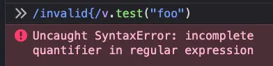

<style>
:root {
  /* # H1 */
  --h1-color: #2c3e50;
  --heading-strong-color: #27ae60;
  /* Normal block */
  --bgColor-default: #fafafa;
  --fgColor-default: #2c3e50;
  --fgColor-accent: #27ae60;
  /* Code block */
  --borderColor-default: #007f62;
  --bgColor-muted: #f5f5f5;
  --fgColor-muted: var(--color, --fgColor-default);
  /* Misc. */
  ::selection {
    background-color: #3498db;
    color: #ffffff;
  }
}
</style>

# Contributing to **OSS**, Reflecting on **OXC**

2025/10/25 VueFes Japan 2025

---

## Hello! 👋🏻

---

### Today's theme

Personal reflection as an **OSS** contributor to the **OXC** project:

- What kind of contributions have I made?
- What was I thinking while contributing?

I'll touch on technical aspects, but also other things.

Submitted approximately [200 PRs](https://github.com/pulls?page=1&q=is%3Apr+author%3Aleaysgur+org%3Aoxc-project+created%3A%3C2025-09-01+sort%3Aupdated-desc+is%3Aclosed) between 2024/01/01~2025/08/31.

---

### What is OXC?

> The JavaScript Oxidation Compiler ⚓️
> https://oxc.rs

A set of tools for JS/TS written in **Rust**.

- https://crates.io/crates/oxc
- https://crates.io/crates/oxc_parser
- https://crates.io/crates/oxc_transformer
- https://crates.io/crates/oxc_resolver
- etc...

It covers almost [everything](https://crates.io/users/Boshen?sort=recent-updates)!


---

### What is OXC?

More broadly, provided as various tools that leverage its performance:

- [`oxc-parser`](https://www.npmjs.com/package/oxc-parser): 3x faster than SWC (which is already considered fast)
  - See https://github.com/oxc-project/bench-javascript-parser-written-in-rust
  - (TS)ESTree AST compatible!
- [`oxlint`](https://www.npmjs.com/package/oxlint): 50-100x faster than ESLint
  - See https://github.com/oxc-project/bench-javascript-linter
  - 🆕 Now supports [`--type-aware`](https://oxc.rs/blog/2025-08-17-oxlint-type-aware.html) linting
  - 🆕🆕 Finally supports [`jsPlugins`](https://oxc.rs/blog/2025-10-09-oxlint-js-plugins.html)
- And more to come...

It's also used internally by [Rolldown](https://github.com/rolldown/rolldown), which is the core of the next version of [Vite](https://github.com/vitejs/rolldown-vite).

---

### PROTIP 💡


---

## Before and after my first PR 🌅

---

### Me and Rust 🦀

- As a front-end engineer, I never use Rust at work
  - I had expectations (~~or hopes~~) that I might use it with WASM
- Only used for [LeetCode](https://leetcode.com) in my free time and [Advent of Code](https://adventofcode.com) at the end of each year
  - Repeating the cycle of learning <-> forgetting for 3 years. 🤯

In the fall of 2023, I realized that contributing to OSS might be the best way to learn it!

---

### Me and OSS

- I'm not a total newbie 😀
- Occasionally submit PRs, participate in discussions on issues
- I also publish and maintain my own OSS projects

I've long followed well-known OSS projects I use at work.
But I've never been deeply involved in a specific OSS project.

---

### a.k.a. "半年ROMれ"

- I knew about OXC's momentum and was interested
  - But didn't know where to start
  - And wasn't particularly skilled in Rust
- So I watched ALL Commits/Issues/PRs, just observing
- Wrote code without submitting PRs, comparing with others' merged PRs

> Lurk Moar | Know Your Meme
> https://knowyourmeme.com/memes/lurk-moar

---

### Don't want to bother maintainers

- To follow the norms, start by understanding first
  - Context and reasons for closed Issues/PRs, conventions
  - Which issues have higher priority
  - Who's active (their areas, timezones, etc.)
  - Where I could work without conflicting with others
  - etc...
- Learn conventions for code and beyond
  - Labels like `Good first issue` and `Help wanted`
  - Performance-focused (benchmarks run per PR)
  - Some limitations (e.g., no TS type info available)

㊗️ 2023/12: `oxlint` GA [announced](https://oxc.rs/blog/2023-12-12-announcing-oxlint.html)

---

### 2024/01: My first PR

> feat(tasks): Add eslint-plugin-jsdoc rulegen by leaysgur · Pull Request #1965 · oxc-project/oxc
> https://github.com/oxc-project/oxc/pull/1965

Just added a template generation command for linter rule implementation.

(I found that I'd given up on implementing `eslint-plugin-jsdoc` rules at this time. 🥹)

---

### `tasks/lint_rules` CI

- CI task to [visualize](https://github.com/oxc-project/oxc/issues/684) rule implementation progress per plugin
  - GHA that installs ESLint plugins locally and compares with Rust code string parsing results
- Written in JS, not Rust
  - A certain plugin dynamically defined rule lists in JS, which Rust couldn't parse


---

### OSS contribution isn't just about code

- You can contribute to Rust projects without writing Rust
- Actually, such opportunities are everywhere
  - Playground: https://github.com/oxc-project/playground
  - Docs: https://github.com/oxc-project/oxc-project.github.io

In fact, just commenting on Issues, chatting on [Discord](https://discord.com/invite/9uXCAwqQZW), or sharing usage insights and research results - all are OSS contributions!

---

## VS JSDoc 🏺

---

### Pandora's Box

> feat(ast,parser): parse jsdoc · Issue #168 · oxc-project/oxc
> https://github.com/oxc-project/oxc/issues/168

- Issue left untouched since 2023/03
  - Buried at the bottom of the issue list for a long time!
- Initially opened it light-heartedly
  - Nobody doing it = good chance to learn Rust thoroughly?
  - Revenge for the `eslint-plugin-jsdoc` I gave up on
  - Used JSDoc TS often at work, felt somehow doable

Soon learned why nobody touched it... 😇

---

### All about JSDoc

```js
/** @type {string} myName */

/************************************
 * @you    @also       @your    @tag
 *     @can     @create     @own

   @omg */
```

- Multi-line comments starting with `*`
- Can write `@tag` to freely assign meaning
- No spec defined

NO SPEC DEFINED!

---

### Who owns comments?

Comment-to-AST mapping is a tricky topic, not defined even in ESTree.

```js
/** `const`, `x` or arrow function? */
const x = () => {};

// Do you remember Flow?
function method(param /*: string */) /*: number */ {
  return 1;
}
```

They can be written anywhere, requires considering newlines and also spaces.

> Standardize Comment Types · Issue #201 · estree/estree
> https://github.com/estree/estree/issues/201

---

### `eslint-plugin-jsdoc`: `tagNamePreference` option

```json
"jsdoc": {
  "tagNamePreference": {
    "param": "arg",
    "returns": "return"
  }
}
```

- Has an [option](https://github.com/gajus/eslint-plugin-jsdoc/blob/main/docs/settings.md#alias-preference) to alias tags with arbitrary names
- Means parser can't statically parse without knowing ESLint config

In this case, must handle everything dynamically at runtime...

---

### Managed it somehow

- Landed as an implementation specialized for `eslint-plugin-jsdoc`
  - Provide several runtime methods per use case
- But burned out after implementing 18 rules... 😶‍🌫️
  - [☂️ eslint-plugin-jsdoc · Issue #1170 · oxc-project/oxc](https://github.com/oxc-project/oxc/issues/1170)

IMPORTANT: After that, my use of JSDoc TS drastically decreased. 🙊

---

### As much history, as many circumstances

- For JSDoc, everything depends on use case
  - Who owns the comments
  - What format is expected
- = Everyone has their own implementation
  - Original [JSDoc](https://jsdoc.app), [TypeDoc](https://typedoc.org), [JSDoc TS](https://www.typescriptlang.org/docs/handbook/jsdoc-supported-types.html), [eslint-plugin-jsdoc](https://github.com/gajus/eslint-plugin-jsdoc), etc...

Comments are a constant headache in JS tooling...

---

### Further reading 🫠

- [JavaScriptのASTにおける、コメントの扱いについて | Memory ice cubes](https://leaysgur.github.io/posts/2024/01/30/132331/)
- [gajus/eslint-plugin-jsdocのコードを読む Part 1 | Memory ice cubes](https://leaysgur.github.io/posts/2024/02/22/133316/)
- [gajus/eslint-plugin-jsdocのコードを読む Part 2 | Memory ice cubes](https://leaysgur.github.io/posts/2024/02/22/140322/)
- [gajus/eslint-plugin-jsdocのコードを読む Part 3 | Memory ice cubes](https://leaysgur.github.io/posts/2024/02/22/143218/)
- [TypeScriptのASTにおける、JSDocの扱いについて | Memory ice cubes](https://leaysgur.github.io/posts/2024/02/28/162354/)
- [現存するJSDocタグのまとめ | Memory ice cubes](https://leaysgur.github.io/posts/2024/03/18/093214/)
- [JSDocをサポートするということ Parse編 | Memory ice cubes](https://leaysgur.github.io/posts/2024/04/26/145407/)
- [JSDocをサポートするということ Attach & Find編 | Memory ice cubes](https://leaysgur.github.io/posts/2024/06/11/155339/)

---

## Road to the `eslint/no-invalid-regexp` 🗻

---

### `/Hello,? [rR]egular(_|-)expression/v`

In JS, invalid regexp "literals" cause syntax errors.


- Want to detect this as a parser
  - [feat(linter): regex parser · Issue #1164 · oxc-project/oxc](https://github.com/oxc-project/oxc/issues/1164)
- Also want to implement regexp-related ESLint rules with parsed results
  - [no-invalid-regexp - ESLint - Pluggable JavaScript Linter](https://eslint.org/docs/latest/rules/no-invalid-regexp)

Several brave souls tried, but the path remained unfinished.

---

### A journey of a thousand miles

- (~~Unlike JSDoc~~) RegExp has a [spec](https://tc39.es/ecma262/2025/multipage/text-processing.html#sec-regexp-regular-expression-objects)!
- However, didn't know how to read BNF notation
  - Did a bit of packet parsing when working on WebRTC
- Started by studying existing implementations
  - `oxc_parser` itself
  - https://github.com/jviereck/regjsparser
  - https://github.com/eslint-community/regexpp


---

### How to proceed when you don't know

- [Visualize](https://github.com/oxc-project/oxc/pull/3824) tasks
  - List even research plans as tasks
- Share progress and concerns frequently
- Ask immediately when stuck

Communication matters in both work and OSS.


---

### Did it! ✌🏼

- First implementation took ~1.5 months
  - Rewrote several times along the way
- No results at first
  - But kept going, understanding deepened daily
- Also implemented proposals that were still Stage 3

Handling bug fixes and edge cases, everything settled after ~3 months.

---

### About parsing `RegExp`

- [30 Minutes to Understand All of `RegExp` Syntax](https://leaysgur.github.io/slides/jsconf_jp-2024/)(en)
  - My talk slide at JSConf JP 2024
- Supporting not just `/a'b"c/` but also `new RegExp("a'b\"c")` in non-JS is hard
  - Must consider escapes when reporting positions in source
  - In JS, escapes are automatically resolved: `"\"".length === 1`
  - Also can't allow `<CRLF>` 😤

---

### About parsing ECMAScript

- Don't necessarily need to parse in spec order
  - OK as long as it parses correctly
  - `oxc_parser` is prime example, heavily tuned 🏎️
  - Though new syntax additions can be tricky
- There's a legacy called Annex B
  - Loose syntax kept for web backwards compatibility
  - Had to rewrite because of this, code increased ~30%

---

### Further reading 🔖

- [@eslint-community/regexpp のコードを読む | Memory ice cubes](https://leaysgur.github.io/posts/2024/06/19/114102/)
- [ECMAScriptのRegExpに関するプロポーザルのまとめ | Memory ice cubes](https://leaysgur.github.io/posts/2024/07/12/101358/)
- [JSで書かれたECMAScript RegExpパーサーの比較 | Memory ice cubes](https://leaysgur.github.io/posts/2024/08/05/143855/)
- [ECMAScript `RegExp`パーサー実装の手引き Part 1 | Memory ice cubes](https://leaysgur.github.io/posts/2024/08/27/092541/)
- [ECMAScript `RegExp`パーサー実装の手引き Part 2 | Memory ice cubes](https://leaysgur.github.io/posts/2024/08/27/093543/)
- [ECMAScript `RegExp`パーサー実装の手引き Part 3 | Memory ice cubes](https://leaysgur.github.io/posts/2024/08/27/095042/)
- [Rustで正規表現パーサーを実装していたら、なぜか文字列リテラルパーサーを実装していた | Memory ice cubes](https://leaysgur.github.io/posts/2024/10/23/124919/)

---

## First Half Summary ☕️

---

### JUST DO IT.

- Even without experience, you can do more than you think
  - Takes time, but consistency is key
- Communication skills needed everywhere
  - Can learn in OSS and apply to work
- In the AI era, even those less skilled at coding can contribute
  - But don't forget about reviewers...

---

### My motivation back then

> https://x.com/lukeed05/status/1829527267162345651

Knowing OSS maintenance is hard, hoped my small contribution could help. 🙏


---

### 2024/10: void(0) announcement

> Announcing VoidZero - Next Generation Toolchain for JavaScript | VoidZero
> https://voidzero.dev/posts/announcing-voidzero-inc

Relief. ☺️

Thought casually "hope more OSS becomes actual work"?

---

### Achievements unlocked 🔓

- Became OSS core member
  - [Meet the Team | The JavaScript Oxidation Compiler](https://oxc.rs/team)
- Got paid for OSS work
  - [[$50 Opire Bounty] feat(linter): eslint/no-invalid-regexp · Issue #611 · oxc-project/oxc](https://github.com/oxc-project/oxc/issues/611)
- Got GitHub sponsors
  - Thank you very much for the past and current sponsors 💖

---

## To the second half 🚀

---

## The Art; Prettier formatter 🖨️

---

### Rewrite Prettier in Rust!

> Rework `oxc_prettier` · Issue #5068 · oxc-project/oxc
> https://github.com/oxc-project/oxc/issues/5068

Port Prettier like we did with ESLint -> `oxlint`.

This time, started with ~40% already implemented.
Should've just needed to keep improving coverage.

---

### Steady work again

- Read and summarized Prettier code
  - [Prettier のコードを読む Part 1 | Memory ice cubes](https://leaysgur.github.io/posts/2024/09/02/103846/)
  - ...(omitted)
  - [Prettier のコードを読む Part 10 | Memory ice cubes](https://leaysgur.github.io/posts/2024/10/08/132257/)
- [Visualized progress and organized TODOs](https://github.com/oxc-project/oxc/issues/5068#issuecomment-2507272735)

The more I learned, the less I felt I could do it alone.
Didn't need to do it all alone, wanted anyone to join.

---

### However...

Months spent, ~30 PRs done, but progress was meh 😵‍💫

- Not many people joined
  - My availability was also fragmented
- Tracing dynamic JS code is hard
  - BTW, `debugger` in DevTools is really great
- Different AST structure, concerns everywhere
  - Comments headache again
  - Especially complex, requiring per-location, per-node, per-use-case handling

After consideration, decided to abandon direct Prettier port approach.

---

### Fork `biome_formatter`

Instead, decided to fork only Biome's Formatter infrastructure.

- [`biome_formatter`](https://github.com/biomejs/biome/tree/main/crates/biome_formatter)
  - On top of this, `biome_js_formatter` and `biome_xxx_formatter` are built
- Needs modification to work with OXC's AST, not Biome's CST
  - Still, using working Rust code is huge

...was working on this for a while.

---

### However...

Eventually gave up and handed it off 😢

- OXC's performance relies on strict memory handling and lifetime annotations
- Biome's code is polished, heavily uses traits and macros

When combined, got completely lost.

Entirely due to my Rust skills lacking, so frustrating...

---

### And time passed...

- Implementation progressed rapidly, now 90%+ coverage
  - This is VoidZero... different league... 😂
- Will be available as `oxfmt` soon
  - [RFC: Formatter · oxc-project/oxc · Discussion #13608](https://github.com/oxc-project/oxc/discussions/13608)

---

### Learned my limits

- Felt Rust's hard parts deeply
- Even with motivation, impossible is impossible
  - Time is finite, businesss constraints also exist
- But feedback from research and insights has value
  - Capable people make good use of it
- Both Prettier and Biome formatter are great

🎂 [Vjeux » Birth of Prettier](https://blog.vjeux.com/2025/javascript/birth-of-prettier.html)

---

## ESTree compatible AST 🌲

---

### ESTree support for `oxc_parser`

- [ESTree](https://github.com/estree/estree) is the de facto standard AST structure
  - Essential to support for existing ecosystem
- `oxc_parser` as a Rust crate has its own AST structure
  - Somewhat similar to Babel AST, but different
- Task: somehow map and convert structures

JS was done, but JSX and TS were WIP.

> [Align JS-side AST with standard for JSX · Issue #9703 · oxc-project/oxc](https://github.com/oxc-project/oxc/issues/9703)
> [Align JS-side AST with standard for TypeScript · Issue #9705 · oxc-project/oxc](https://github.com/oxc-project/oxc/issues/9705)

---

### Though it's de facto

ESTree only specifies pure JS; JSX and TS are out of scope.

So, follow well-known parsers as prior implementations.

- JSX: [`acorn`](https://github.com/acornjs/acorn) + [`acorn-jsx`](https://github.com/acornjs/acorn-jsx)
- TSX: [`@typescript-eslint/typescript-estree`](https://github.com/typescript-eslint/typescript-eslint/tree/main/packages/typescript-estree)

---

### Simple as a task

```js
// 1. Prepare sample code
const INPUT = `class X {}`;

// 2. Output AST with prior implementation
// 3. Output AST with OXC too
const [theirsAst, oursAst] = [parseTheirs(INPUT), parseOurs(INPUT)];

// 4. Compare both ASTs
const diff = diffAst(therisAst, oursAst);

// 5. If there's a diff, write conversion code
if (diff) {
  console.log("TODO: Mismatch!");
}
```

Easy, right? 🫣

---

### Difficulty: Easy

- Just rename
  - `(String|Boolean|...)Literal` > `Literal`
  - `XxxExpression.(expression|field)` > `.property`
- Just skip unnecessary fields
- Flatten nesting: spread, append, prepend
- Just add fixed value fields
- `None` to `[]` or `false`
- etc...

Just add custom attribute macro `#[estree(...)]` to `struct`, then implementation auto-generated at [build](https://github.com/oxc-project/oxc/blob/main/tasks/ast_tools/src/derives/estree.rs) time. Beautiful!

---

### Difficulty: Medium

```ts
class X {
  constructor(
    // type: Identifier
    name: string,
    // type: TSParameterProperty 👈🏻
    private age: number,
  ) {}
}
```

Need to manually add logic to convert AST to desired structure.

```js
// Simplified ver.
if param.has_modifier() {
  return { type: "TSParameterProperty", ... };
}

return { type: "Identifier", ... };
```

---

### Difficulty: Hard

```ts
module X.Y.Z {}
```

- OXC AST: Nested `TSModuleDeclaration` x3
- TS-ESTree: Single `TSModuleDeclaration` and nested `TSQualifiedName` x3

AST structures can be completely different!

---

### Even for JS diffs...

> JS Multi AST Viewer
> https://leaysgur.github.io/js-multi-ast-viewer/

- 👈🏻 JS: `acorn`
- 👉🏻 TS: `@typescript-eslint/typescript-estree`

Even between TS's JS and JS's JS, many subtle differences exist.


---

### Wrote JS here too

[](https://github.com/leaysgur/oxc_estree_ts-ast-diff-viewer)

---

### Finally...

- Reached 100% compatibility for JS, JSX, and TSX! 🎉
- Strictly speaking, some differences still remain
  - Missing [`loc`](https://github.com/oxc-project/oxc/issues/10307), JSX [HTML Entities](https://github.com/oxc-project/oxc/issues/9667) differences, etc.

As a result of compatibility:

- Prettier can now use oxc parser
  - [`@prettier/plugin-oxc`](https://github.com/prettier/prettier/tree/main/packages/plugin-oxc)
- Was a step toward `oxlint` JS plugins

---

### ESTree Tips

- Not spec-driven, just a "result" of historical evolution
  - Properties like `raw` are common but not in spec
    - [ESTreeの`Literal`ノードの`raw`プロパティ | Memory ice cubes](https://leaysgur.github.io/posts/2025/03/11/124250/)
- No AST node representing `(`...`)`
  - Essential for `/** @type */(foo)`
  - Rarely changes code meaning
    - `fn.name`: `(fn) = function () {}` vs `fn = function () {}`
  - Some parsers have option to preserve it
- `@sveltejs/acorn-typescript` also called TS-ESTree
  - But different AST structure from `@typescript-eslint/typescript-estree` 😦

---

## Best TypeScript parser without types 🚨

---

### More strict, more reliable

> parser: Improve TS error story · Issue #11582 · oxc-project/oxc
> https://github.com/oxc-project/oxc/issues/11582

- Coverage to verify TS syntax support
  - Can parse (no syntax errors)
  - Can't parse (has syntax errors)
- Currently, former is high (99%) but latter is low (40%)
- Can't detect errors requiring type info, dragging it down
  - Task is to exclude these

Too many false positive logs, might be missing things we should catch.

---

### TSC baseline test fixtures

> https://github.com/microsoft/TypeScript/tree/main/tests

- This is snapshot collection for TSC: parser/checker/bundler/etc
  - Type errors, config errors, errors only in old ES versions, etc...
  - Contains `.css`, `.map`, `.md`, even invalid `.ts` file

Need to filter out what `oxc_parser` doesn't care about.


---

### TSC Diagnostics

> error TS2322: Type 'number' is not assignable to type 'string'.
> error TS18033: Type 'string' is not assignable to type 'number' as required for computed enum member values

- Error codes are separated, but can't judge mechanically
- APIs are separate too, but...
  - `tsProgram.getSyntacticDiagnostics()`
  - `tsProgram.getSemanticDiagnostics()`
    - Some mixed in that seem like syntax errors

Want to let AI judge everything, but effort to review 🆚 do it myself...

---

### Yet another (vibed) viewer...

[](https://github.com/leaysgur/tsc-error_diagnostic_codes-viewer/)

---

### Can't read TSC

- Can't read even in TS
- Can't read even in Go

Just wish AI would rewrite it in Rust soon.

---

### Further reading 🙂

- [TypeScriptのテストファイルの読み方 | Memory ice cubes](https://leaysgur.github.io/posts/2025/04/30/110214/)
- [TypeScriptの`Diagnostics`について | Memory ice cubes](https://leaysgur.github.io/posts/2025/06/13/131109/)
- [続・TypeScriptの`Diagnostics`について | Memory ice cubes](https://leaysgur.github.io/posts/2025/06/18/130151/)
- [TypeScriptCompilerのベースラインとテストの仕組み | Memory ice cubes](https://leaysgur.github.io/posts/2025/06/16/103331/)

---

## Summary 🍵

---

### Why OSS?

- Fun, can do things contrasting with routine work
  - Senior at work, junior in OSS
- Meet various people
  - Even unreachable people in the clouds
  - (When do these people sleep or rest? 🤔)
- Also a form of social contribution
  - Can get paid or turn into work
- Can write lots of blog posts 💪
  - AI can write technical docs, but not personal writing

---

### There's always something to do

- Just not visible yet
  - Not everyone likes TODO lists, so organizing issues may help
- You can start from today:
  - Handle duplicate issues, comment on Discussions, help with repros
  - Add missing docs, or just fix typos
  - Make CI logs more readable
  - etc...
- Just post your feedback!
  - Especially positive, it helps me a lot! 🥰

Still, I recommend to understand the project culture before jumping in.
Some are welcoming, others have high standards.

---

### With AI era

- Less to do, but not gone
  - Easy, quick tasks will disappear
  - Easy but tedious work will disappear
- But still much AI can't do (yet)
  - Things requiring human final check
- On the flip side, AI lets you explore new domains!

Just be careful for AI slop... 🤖

---

## About me 🙏

---

### Yuji Sugiura

- Software Engineer at [VoidZero Inc.](https://voidzero.dev)
  - 🆕 2025/09/01~
- [OXC](https://oxc.rs) ⚓️ Core team

Working from Shiga pref.


---

### @leaysgur

- X(Twitter): [@leaysgur](https://x.com/leaysgur)
- GitHub: [leaysgur](https://github.com/leaysgur/)
- Blog: [Memory ice cubes](https://leaysgur.github.io/posts/)


---

### [PR] Follow us!

- X(Twitter): https://x.com/OxcProject
- GitHub: https://github.com/oxc-project/oxc
- Discord: https://discord.com/invite/9uXCAwqQZW

私にはもちろん日本語で大丈夫です！


---

# Thank you!
