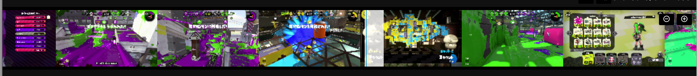

title: 動画切り出しアプリをElectronで作った
controls: false
--

# <a>動画切り出しアプリ</a>を Electronで作った
## 2018/03/04-06 PixelGrid Inc. 開発合宿 in 湯河原

--

# モチベーション

--

### 全部<a>イカ</a>のせい

- 普段のプレイ動画はYouTubeにUPしてる
  - けど、全てのシーンをUPしてるわけではない
- UPしてない箇所から数秒だけを切り出して、TwitterにUPしたいと思うことがある
  - が、編集が面倒くさい
  - YouTubeにUPする用の動画を作るアプリ（録画アプリ付属）だと、元動画の開き直しが面倒くさい

これをなんとかしたい！

--

### 既存のアプリではダメ？

あるにはあるけど、

- Twitterの動画投稿フォーマットに沿ってない
  - https://help.twitter.com/ja/using-twitter/twitter-videos
  - これが割と微妙なラインを攻めてくる
- 余計な機能たくさんついてる
- 画質がいまいち（良くも悪くも）
  - そして調整できない
- 謎のバナーが付いたり

惜しい。

--

### CLIではダメ？

やれんことはないけど、

- 巨大な動画（2時間で30GBとか）もあるので、GUIじゃないと辛い
- `Preview.app`でひらいて、切り取り秒数をメモって`ffmpeg`で・・
  - いやなにそれ面倒くさい
  - てかそれができるアプリください！

もう自作するしかない・・！

--

# というわけで、できました
## https://github.com/leader22/movie-slicer

--

# DEMO

--

### 作ったもの
- https://github.com/leader22/movie-slicer
- 動画をトリミングして書き出せるElectronアプリ
  - 裏で動くのは毎度おなじみ`ffmpeg`
  - つまり、`ffmpeg`に渡す引数をGUIで操作できるアプリ

--

### 使ったもの（抜粋）
- Electron v1.8.2
- React v16.2
- MobX v3.6
- ffmpeg / ffprobe v3.4.1
- Webpack v4.1

See https://github.com/leader22/movie-slicer/blob/master/package.json

--

### 使おうとしてやめたもの（一部）
- 生ES Modules
  - Electronのエントリーが`file://`なのでダメ
  - React使いたいのでダメ
  - Webpack最高
- WebComponents
  - 言いたいこと山ほどある
  - これだけでアプリ作るの一生無理やと思う
- Redux
  - 規模的にも無用の長物
  - 便利に使うにはMiddlewareまみれにならないと無理
- MobX v4
  - さっきBetaがリリースされたところ
  - Webpackで読むとエラーになった＼(^o^)／

--

# 推しポイントの紹介

--

### タイムライン: サムネイル

- 動画の様子が見やすい
  - ざっくり切り取り位置を探すのに最高
- そのぶん実装は大変だった
  - 動画長と画面サイズから、1サムネイルあたりの秒数を割り出す
  - その秒数で、サムネイルが何枚必要かを割り出す
  - この2つの積を、`video.currentTime`に指定してく
  - `canplay`イベントを待って、非同期で`video`を`canvas`に転写して表示

--

### タイムライン: 拡大と縮小

- 右上のボタン2つ
- 短い動画・長い動画、どちらがきても編集しやすいように
  - 5分の動画から3時間の動画までいい感じに
- 実装は、「1秒を何pxとして扱うか」を倍率とあわせて管理
  - アプリ内の幅や位置は、この値をかけて算出する

--

### タイムライン: 選択する部分

- 中央の薄白い部分
- 範囲選択がしやすいように
  - ドラッグでいい感じに移動可能
  - フチを掴んでリサイズ可能
  - 半分くらい`bokuweb/react-rnd`のおかげ
    - ただしイベントを`stopPropagation()`させてくれなくてfolkしかけた
- その選択範囲を繰り返し再生
  - 出来上がりを想像しやすくて最高

--

### 書き出し結果の表示

- 書き出し後に、どういうフォーマットになったかを表示するようにした
- Twitterの動画投稿フォーマットの面倒なところ
  - 40FPS以下
  - 2分20秒以内
  - etc...
- アップロードしてからエラーにされないために・・

--

### それっぽいデザインとそれっぽいUX

- 温かみのある手書きCSSによるそれっぽいデザイン
- アイコンは、[Material Icons](material.io/icons/)より
  - 必要なものだけSVGでローカルに
- アプリ感のあるUX
  - 動画をドロップして起動
  - 切り出し後は`Finder`で表示
  - メニュー・キーボードショートカット完備

我ながらよく頑張った。

--

# 学び

--

### `H.264`を`ffmpeg`で扱う
- WebRTC界隈でもよく見るコーデック
- 再エンコなしの切り出しは高速
  - 3時間から数十秒切り出すのも一瞬でできる
- ただし`preset`を調整すれば、エンコありでもそれなりで終わる
  - 現状`ultrafast`が最も速度重視だが、もっと攻めてほしい

こういう親和性の面でみると、VP8/9よりも良いよね・・。

--

### Electronでの開発
- この2つだけで十分
  - `sindresorhus/electron-reloader`
  - `webpack`(`target: electron-renderer`)
- ビルドは`electron-userland/electron-packager`で楽々
- ハマったのは環境変数（パス）の問題だけ
  - [ElectronでMainプロセスからchild_processでコマンドを叩くとエラーコード: 127 - console.lealog();](http://lealog.hateblo.jp/entry/2018/03/05/171036)

アプリ用アイコンの作成がいちばんつらかった（カッコいいアイコンほしい・・）

--

### Webpack v4
- 手書きconfigなライトユーザーなので、特につまづきポイントなし
  - `npm i webpack webpack-cli -D`
  - `webpack --mode development -w`
- `--mode production`だけでMinifyしてくれる
  - この`mode`のおかげで`DefinePlugin({})`だけで`NODE_ENV`が取れる
    - 謎`JSON.stringify()`が不要に！

どっかの誰かのオレオレボイラープレートを使ってる勢は、更新されるまで耐えてください。

--

### Web技術、もといMediaRecorderのことは

- 忘れてください
  - 詳細は[前回](https://leader22.github.io/slides/pxg_camp-2017b/#15)の合宿発表を参照
- ただスナップショットの取得を`canvas.toBlob()`でやるのは十分に実用的
  - まあ`ffmpeg`が使える状況なのでそっち使ったけど・・

--

# おまけ

--

### 今回の作業の内訳

- 合宿前
  - 各種検証
    - そもそも巨大な動画を`video`でロードできるかとか
    - Electronから`ffmpeg`どう呼ぶか
    - `ffmpeg`の引数・処理速度の確認
  - アプリのUI、仕様のFix
- 1日目: 見た目以外と本筋の機能は完成
  - 基本的な機能と書き出しまでの導線
  - タイムラインの細かい機能
- 2日目: ひたすら完成度を高める
  - 見た目の調整
  - 書き出し設定
  - メニュー・ショートカット
  - アプリのパッケージ化
  - バグ修正
  - プレゼン資料ざっくり
- 3日目: のんびり暮らす
  - 見た目や使い勝手の調整
  - プレゼン資料の微調整

--

# Thank you!

<link rel="stylesheet" href="../public/base.css">
<link rel="stylesheet" href="../public/timer.css">

