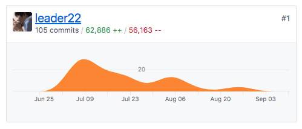

title: SkyWay JS SDKの歩き方
controls: false
--

# <a>SkyWay JS SDK</a>の歩き方

## &nbsp;
## 2017/09/29 SkyWay Developer Meetup #1

--

### はじめまして

- Yuji Sugiura
- フロントエンド・エンジニア at PixelGrid Inc.
- Twitter: [@leader22](https://twitter.com/leader22)
- ブログ: [console.lealog();](http://lealog.hateblo.jp/)


--

### SkyWayの中の人？やってます

https://github.com/skyway/skyway-js-sdk/graphs/contributors



※訳: （お忙しい本当の）中の（人に代わってがっつりコードを書く業を請けてる）人です

--

### やったこと

- 既存APIを壊さない範囲でのリファクタ
- ビルド / 開発環境の整理
- ES Modules化
- Safari / Edge対応（一部）
- ブラウザの謎挙動の調査
- 機能追加あれこれ
- etc..

仕事してみての感想: これがWebRTC沼か😇

--

# ＼ 祝・商用リリース 🎉 ／

--

# SkyWay JS SDKの歩き方

--

# SkyWay JS SDKの歩き方
## もとい、5分でわかるSkyWay JS SDK

--

### SkyWay JS SDK


- https://github.com/skyway/skyway-js-sdk
- Star / Watch数はまだ控えめ・・ <- 今がチャンスですよ！
- インストール
  - CDN: https://cdn.webrtc.ecl.ntt.com/skyway-latest.js
  - or ↑をダウンロードして自分で埋める
  - or GitHubからクローンしてきて自分でビルドする
  - 今のところ`npm`からは利用できません

--

### ライブラリの構造

```js
/src
├── peer.js
├── peer
│   ├── connection.js
│   ├── dataConnection.js
│   ├── mediaConnection.js
│   ├── room.js
│   ├── meshRoom.js
│   ├── sfuRoom.js
│   ├── negotiator.js
│   └── socket.js
└── shared
    ├── config.js
    ├── logger.js
    ├── sdpUtil.js
    └── util.js
```

2017/09/29時点です。

コードは全部4000行ほど。あれだけのことをやってるなら妥当な量・・？

--

### ざっくり簡略化すると

- Peer: 親玉であるメインのオブジェクト
  - peer/
    - XxxConnection: Media or Data extends Base
    - XxxRoom: Mesh or SFU extends Base
    - コア: 実際にP2P通信を行う（ユーザーは触らない）
  - shared/
    - その他: ただの関数・定数（ユーザーは触らない）

`Peer`と、各`Connection`、各`Room`さえ把握すればOK！

--

### コードを読むなら

- とりあえず読むなら
  - peer.js
- そこから返るクラス
  - peer/mediaConnection.js
  - peer/dataConnection.js
    - それぞれ peer/Connection.js を継承
  - peer/meshRoom.js
  - peer/sfuRoom.js
    - それぞれ peer/Room.js を継承
- WebRTCのコアなことなら
  - peer/negotiator.js

--

### コードでみても

```js
const peer = new Peer({ key: 'xxxx' }); // Peer

// 1:1なら
const mediaConn = peer.call(peerId); // MediaConnection
const dataConn = peer.connect(peerId); // DataConnection

// N:Nなら
const meshRoom = peer.joinRoom(roomName); // MeshRoom
const sfuRoom = peer.joinRoom(roomName, { mode: 'sfu' }); // SFURoom
```

https://webrtc.ecl.ntt.com/js-reference/ もチェック！

--

# このSDKのココが○○

--

### すごい: OSSである

- コードが読める
- 長年の知見の塊
  - <s>パクれる</s>参考にできる
- 自分で機能追加・修正のPRも出せる

WatchしてるだけでWebRTC界隈全体の動きもわかるかも？

--

### すごい: これがほとんど無料

> https://webrtc.ecl.ntt.com/pricing.html

- 普通に個人で利用するならまず問題ない
- 個人開発の敷居が下がる
  - シグナリングサーバー用意しなくていい
  - まさかのSFUも無料で使える

神・・ 🙏

--

### XXX: 🙊

- 歴史があるので色々とアレなコードもあ・・

時間もないので気になる方は後で個別にどうぞ😇

--

# Thank you!
## [@leader22](https://twitter.com/leader22)

--

### Links

- [このスライド](https://leader22.github.io/slides/skyway_dev_meetup-1)
- [skyway/skyway-js-sdk: JavaScript SDK for SkyWay](https://github.com/skyway/skyway-js-sdk)
- [JavaScript SDK APIリファレンス - SkyWay - Enterprise Cloud WebRTC Platform](https://webrtc.ecl.ntt.com/js-reference/)

<style>
:root {
  --bg-color: #f5f5f5;
  --bar-color: #003B7B;
  --em-color: #4780FF;
}
</style>
<link rel="stylesheet" href="../public/base.css">
<link rel="stylesheet" href="../public/timer.css">
<script src="../public/timer.js"></script>
<script src="../public/mobile-controls.js"></script>
